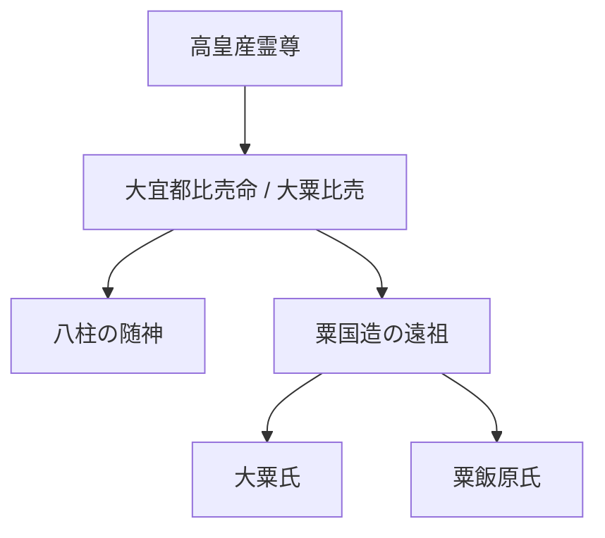

# 阿波説・詳細系譜図集：神々と氏族の繋がり

阿波説（徳島説）において、記紀神話の正当性を証明する鍵となるのは、阿波の土地に伝わる詳細な系譜である。資料に基づき、主要な神々と氏族の繋がりをMermaid記法で可視化する。

---


---

## 🏛 阿波説・詳細系譜図集：詳細論考ポータル

以下の各論点は、独立した専門ノートとして詳細化されている。


### [[忌部氏（いんべし）の系譜|1. 忌部氏（いんべし）の系譜]]
阿波忌部は、高皇産霊尊から始まり、天日鷲命を経て日本全国の開拓へと繋がる。...


## 2. 大宜都比売命（オオゲツヒメ）と粟国造の系譜
阿波の国魂神である大宜都比売命は、独自の系譜を持ち、粟の開拓氏族へと繋がる。



---


### [[スサノオと海部氏（あまべし）の系譜|3. スサノオと海部氏（あまべし）の系譜]]
「海部氏勘注系図」に基づき、スサノオから卑弥呼（大倭姫）に至る阿波の重要系譜。...


### [[初期天皇家の阿波拠点系譜|4. 初期天皇家の阿波拠点系譜]]
崇神天皇（第10代）に至るまでの、阿波の神社に祀られる重要人物たち。...


### [[武市氏・河野氏（越智族）の系譜|5. 武市氏・河野氏（越智族）の系譜]]
徳島市「常三島」の由来となった一族と天皇家の繋がり。...

## 🏺 関連する考古学・物証データ
```dataview
LIST
FROM "理論・研究/02_考古学・物証" OR "資料/Web_Archives/kohun-jinjya_blog/古墳"
WHERE contains(file.name, split(this.地域, "_")[length(split(this.地域, "_")) - 1]) OR contains(tags, "古墳") OR contains(tags, "遺跡")
LIMIT 5
```

