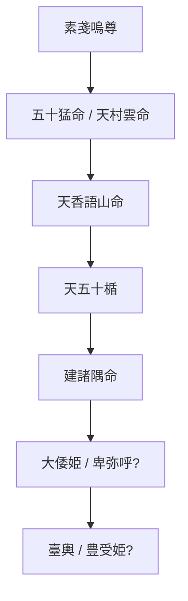

# 3. スサノオと海部氏（あまべし）の系譜

「海部氏勘注系図」に基づき、スサノオから卑弥呼（大倭姫）に至る阿波の重要系譜。

```mermaid
graph TD
    A[素戔嗚尊] --> B[五十猛命 / 天村雲命]
    B --> C[天香語山命]
    C --> D[天五十楯]
    D --> E[建諸隅命]
    E --> F[大倭姫 / 卑弥呼?]
    F --> G[臺輿 / 豊受姫?]
```

---

---
*※本稿は[[阿波説・詳細系譜図集]]から詳細化・分割された専門論考である。*
