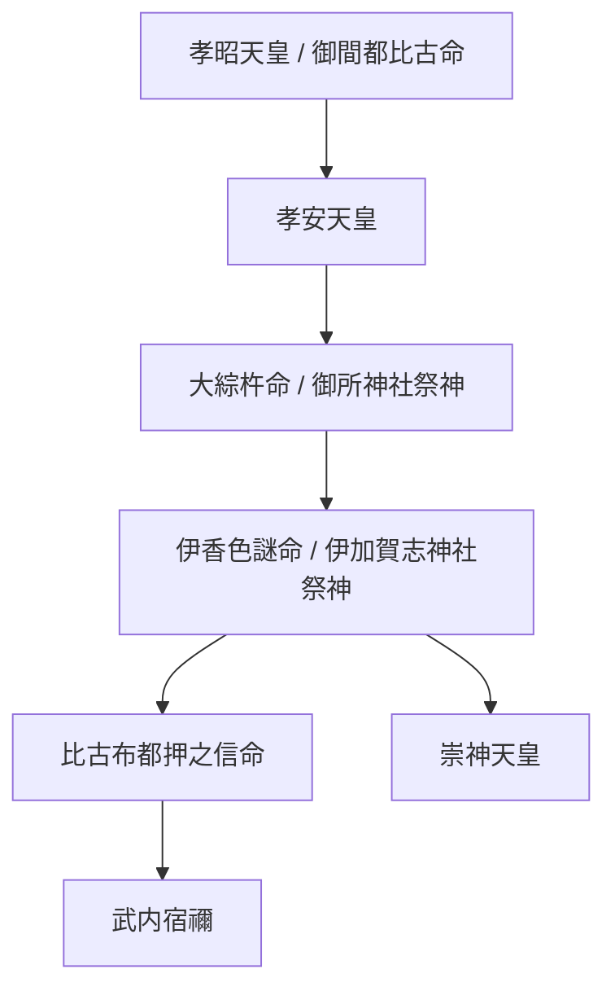

# 4. 初期天皇家の阿波拠点系譜

崇神天皇（第10代）に至るまでの、阿波の神社に祀られる重要人物たち。

```mermaid
graph TD
    A[孝昭天皇 / 御間都比古命] --> B[孝安天皇]
    B --> C[大綜杵命 / 御所神社祭神]
    C --> D[伊香色謎命 / 伊加賀志神社祭神]
    D --> E[比古布都押之信命]
    E --> F[武内宿禰]
    D --> G[崇神天皇]
```

---
*※本稿は[[阿波説・詳細系譜図集]]から詳細化・分割された専門論考である。*
