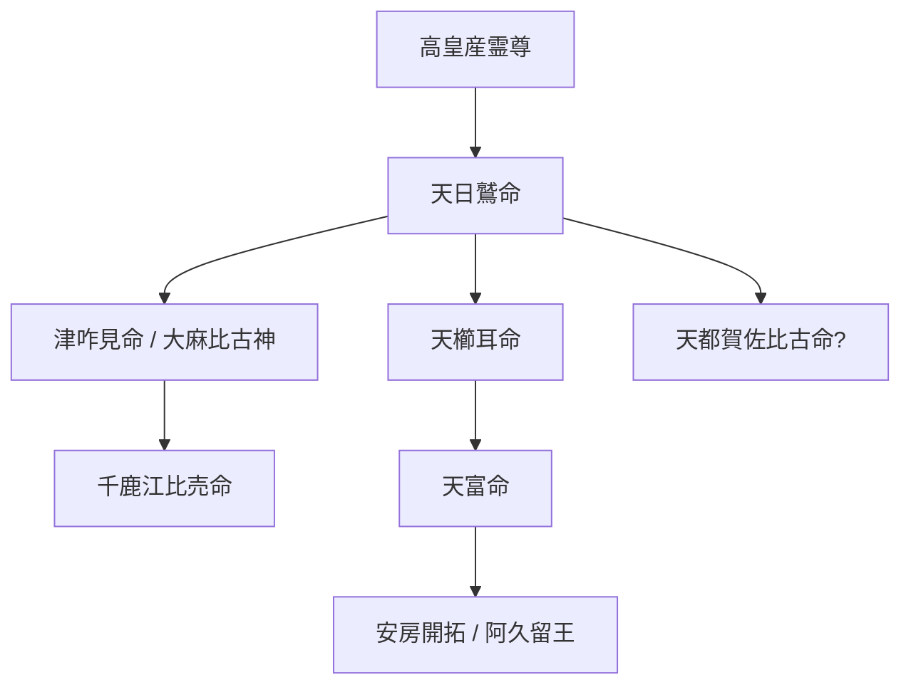

# 1. 忌部氏（いんべし）の系譜

阿波忌部は、高皇産霊尊から始まり、天日鷲命を経て日本全国の開拓へと繋がる。

```mermaid
graph TD
    A[高皇産霊尊] --> B[天日鷲命]
    B --> C[津咋見命 / 大麻比古神]
    B --> D[天櫛耳命]
    B --> E[天都賀佐比古命?]
    C --> F[千鹿江比売命]
    D --> G[天富命]
    G --> H[安房開拓 / 阿久留王]
```

---

---
*※本稿は[[阿波説・詳細系譜図集]]から詳細化・分割された専門論考である。*
