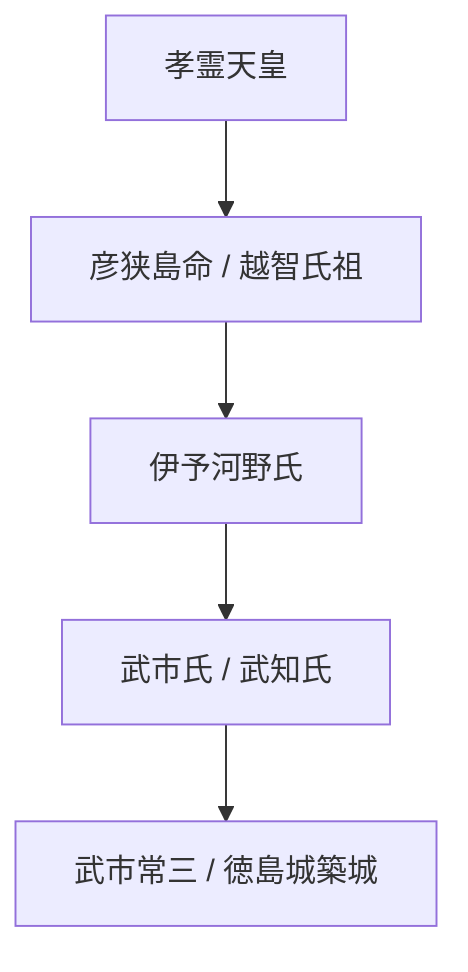

# 5. 武市氏・河野氏（越智族）の系譜

徳島市「常三島」の由来となった一族と天皇家の繋がり。

---
**作成日:** 2026-05-09
**典拠資料:**
- 海部氏勘注系図、古語拾遺、先代旧事本紀
- goutara.blogspot.com
- awanonoraneko.hatenadiary.com
- awa-otoko.hatenablog.com

---
*※本稿は[[阿波説・詳細系譜図集]]から詳細化・分割された専門論考である。*
