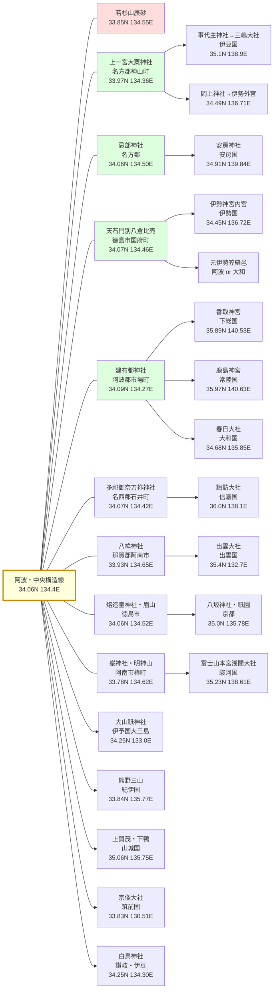
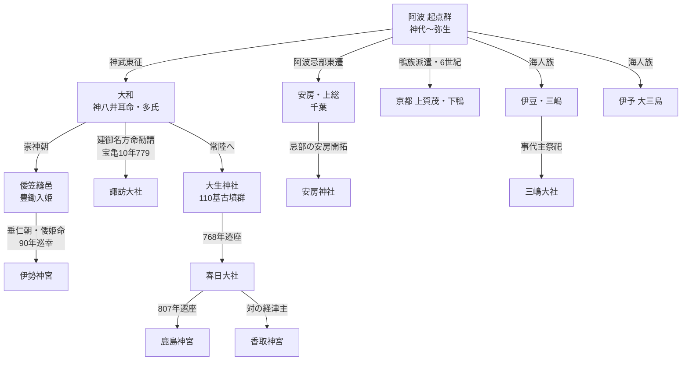

# 元宮ハブ_MOC

阿波説における **「○○の元宮は阿波にある」** という伝承・主張を全国神社別に統合する中間ハブ。

> 「全国の有名神社の本源は阿波にあり、後世各地へ勧請・遷座した」――この命題を支える社伝・地理・系譜・物的証拠を一覧化する。

---

## 🎯 「元宮」の定義と本ノートの守備範囲

### 「元宮」とは何か

| 用語 | 意味 | 例 |
|---|---|---|
| **元宮（もとみや）** | ある神社の祭神・神格が最初に祀られた場所 | 諏訪大社の元宮＝多祁御奈刀弥神社（阿波） |
| **元社（もとやしろ）** | 同上、特に式内社系の旧鎮座地 | 大山祇神社の元社＝大山（阿讃山脈） |
| **本宮（ほんぐう）** | 系列神社の根本祭祀地。一般には熊野・吉野等で使われる | 熊野本宮大社 |
| **奥宮（おくみや）** | 表参道から離れた山中の元来の祭祀地 | 諏訪大社上社奥宮 |
| **元伊勢（もといせ）** | 伊勢神宮成立以前の天照大神巡幸地 | 笠縫邑、丹後元伊勢、… |

### 阿波説における「元宮」の主張構造

阿波説で「元宮は阿波にある」と主張する際の **論証パターン**：

1. **社伝・由緒**：神社自身の社伝に「○○から勧請」と明記される（例：諏訪大社元宮＝多祁御奈刀弥神社）
2. **時系列整合**：阿波の式内社が遷座先の国史初見より古い記録を持つ
3. **氏族の東遷**：祭祀氏族（多氏・忌部・鴨族）の阿波→各地への移動痕跡
4. **地名複写**：阿波の地名が遷座先に再現される（諏訪・賀茂・三嶋・春日…）
5. **配偶神・系譜の阿波集中**：祭神の家族・親族の祭祀地が阿波に集中
6. **物的痕跡**：古墳・墓・遺物が阿波に現存（沼河姫古墳など）

---

## 📋 全国元宮一覧表（阿波説）

凡例：**確度** ★★★（社伝＋系譜＋物証） / ★★（社伝＋系譜） / ★（伝承のみ）

### 🌏 出雲系

| 遷座先（現在の有名神社）           | 阿波の元宮（候補）                | 阿波の鎮座地     | 主張根拠                               | 確度  |
| ---------------------- | ------------------------ | ---------- | ---------------------------------- | --- |
| **諏訪大社**（信濃国）          | [[多祁御奈刀祢神社]]（多祁御奈刀弥神社）   | 名西郡石井町     | 宝亀10年（779）社伝勧請、二の鳥居「元諏訪」、母・沼河姫古墳現存 | ★★★ |
| **出雲大社**               | [[八桙神社]]（八千矛＝大国主）        | 那賀郡阿南市     | 全国唯一の八千矛神社、長国造の祖神祭祀                | ★★  |
| **三嶋大社**（伊豆国一宮）        | [[事代主神社]]（阿波郡）／勝浦郡の事代主神社 | 阿波郡市場町／勝浦郡 | 事代主祭祀の本源、伊古奈比咩命の阿波説、伊豆地名複写         | ★★★ |
| **下鴨神社**（賀茂御祖神社）       | 下加茂神社（阿波）                | 美馬郡        | 加茂川下流域、玉依姫命祭祀の同一性                  | ★★  |
| **春日大社**（武甕槌＋経津主＋天児屋根） | 大生神社（常陸）経由で阿波忌部・中臣       | （多氏東遷経路）   | 神八井耳命系の多氏の東遷、阿波忌部との縁戚              | ★   |

### 🏔 山岳・海洋系

| 遷座先                  | 阿波の元宮                                            | 阿波の鎮座地            | 主張根拠                                                                                     | 確度  |
| -------------------- | ------------------------------------------------ | ----------------- | ---------------------------------------------------------------------------------------- | --- |
| **大山祇神社**（伊予国一宮・大三島） | 大山（大山寺所在地）                                       | 阿讃山脈、徳島・香川県境      | 「単に大山」と呼ばれた唯一の山、海人族支配の要地、全国系列10000社の本源                                                   | ★★  |
| **八坂神社（祇園）**（京都）     | 熔造皇神社（眉山＝以乃山） | 名方郡 徳島市 眉山頂       | 「八坂の登口」が起源、須佐之男命の鉄鋳造祭祀、阿波一国のみ「熔造皇」と称する社名独自性、眉山西峰・毛受ヶ原の祠と昭和十三年銘百度石、八人塚古墳（素戔嗚陵）            | ★★  |
| **富士山本宮浅間大社**（駿河国一宮） | 峯神社・巖座龍宮総宮社         | 阿南市椿町・由岐町境界 明神山山頂 | 平成7年由緒書きで明言「東方ノ静岡縣富士山ニ祀ル浅間神社ハ此ノ神社ノ本宮」、ヘイアウ型古代神殿、東西南北の家族祭祀対称配置（父大三島／姉津峯／本峯神社／遷座先富士山）、白蛇霊験 | ★★★ |

### ⛩ 賀茂系

| 遷座先 | 阿波の元宮 | 阿波の鎮座地 | 主張根拠 | 確度 |
|---|---|---|---|---|
| **上賀茂神社**（賀茂別雷神社） | [[式内社/01_阿波国/01_郡別調査/美馬郡/鴨神社|鴨神社（阿波）]] | 美馬郡 東みよし町三加茂 | 鴨神社周辺の神社配置が京都と同一（貴船・下鴨・片岡・沢田・大田）、白川氏の社伝、欽明朝6世紀の鴨族派遣 | ★★★ |
| **下鴨神社**（賀茂御祖神社） | 下加茂神社（東みよし町） | 美馬郡 | 加茂川下流域、玉依姫命祭祀 | ★★ |

### ☀ 伊勢系（元伊勢）

| 遷座先               | 阿波の元宮             | 阿波の鎮座地     | 主張根拠                                | 確度  |
| ----------------- | ----------------- | ---------- | ----------------------------------- | --- |
| **伊勢神宮内宮**（天照大神）  | [[天石門別八倉比売神社]]    | 名方郡 徳島市国府町 | 大日孁尊＝天照大神の真陵説、御本記、五角形祭壇、杉尾古墳（卑弥呼陵説）。**気延山山頂の前方後円墳形状の測量・奥之院五角形磐座（伝卑弥呼墓）、魏志倭人伝「径百余歩」との符合**（→ 【伝卑弥呼墓】【伝元伊勢】天石門別八倉比賣神社・気延山 (あまのいわとわけやくらひめじんじゃ・きのべやま)（徳島県徳島市）） | ★★★ |
| **伊勢神宮外宮**（豊受大神）  | [[岡上神社]]（豊受姫命）／丹後 多久神社経由    | 板野郡／丹後 → 阿波        | 豊受姫命祭祀の阿波先行。丹後 多久神社（5段階遷座：和奈佐→岡上神社→多久神社→籠神社→伊勢外宮）→ [[豊受大神：丹後多久神社と阿波の元宮論]]  | ★★  |
| **下鴨神社**（賀茂御祖神社 荒魂） | [[御蔭神社：下鴨神社の荒魂祭祀と阿波鴨族の接点]] | 京都左京区／阿波鴨族の東遷経路 | 葵祭の始まり、玉依姫命・賀茂建角身命の荒魂、創建伝承（綏靖朝＝BC581）と阿波鴨族東遷時期の整合 | ★★ |
| **伊勢神麻続部**（神服織機殿） | 阿波忌部・長白羽命（天八坂彦命）系 | 麻殖郡        | 大嘗祭麁服貢進の阿波忌部血統、三木家文書                | ★★★ |
| **元伊勢笠縫邑**        | 上一宮大粟神社周辺 or 名方郡内 | 名方郡        | 笠縫邑＝阿波・名方郡の比定説                      | ★   |

### 🐉 海神系

| 遷座先 | 阿波の元宮 | 阿波の鎮座地 | 主張根拠 | 確度 |
|---|---|---|---|---|
| **海部氏祖神社（籠神社）**（丹後） | [[和多都美豊玉比売神社]] | 名方郡 | 海部氏勘注系図、天火明命の真の天孫降臨説 | ★★ |
| **宗像大社**（福岡） | [[田寸神社]]（多紀理姫・市杵島姫等） | 美馬郡 | 月読命＋宗像三女神の阿波先行祭祀 | ★ |
| **鹿島神宮**（常陸） | 大生神社（常陸潮来）経由 → 阿波忌部・多氏東遷ルート | （阿波→大和→常陸） | 多氏の東遷、神八井耳命の祖神祭祀、768年春日遷座・807年鹿島遷座、大生古墳群110基 | ★★ |
| **香取神宮**（下総） | 鹿島と対の関係、大生神社経由 | （同上） | 多氏の影響 | ★ |

### 🌸 その他

| 遷座先 | 阿波の元宮 | 阿波の鎮座地 | 主張根拠 | 確度 |
|---|---|---|---|---|
| **率川阿波神社**（奈良・大神神社境内） | [[事代主神社]]（阿波郡）／[[生夷神社]]（勝浦郡） | 阿波郡市場町／勝浦郡 | 率川阿波神社の祭神「**事代主神＋阿波咩命**」のペアが阿波由来。事代主神社という社名の式内社は全国4社中**2社が阿波**に集中。推古元年（593）創建。大神神社（大物主＝大国主の和魂）の御子神祭祀という構造が、阿波の[[大御和神社]]（大国主）→[[事代主神社]]（事代主）の親子祭祀と完全一致 | ★★★ |
| **山住神社**（遠州） | 阿波忌部の東遷経路 | 各地 | 阿波忌部による全国開拓伝承 | ★ |
| **熊野三山** | （複数比定説） | 名方郡 or 那賀郡 | 熊野（クマノ）の語源比定、阿波地名複写 | ★ |
| **白鳥神社**（讃岐・伊豆・全国） | [[白鳥神社]]（板野郡） | 板野郡 | 日本武尊の白鳥伝承、両国一社の真の白鳥陵説 | ★★ |
| **松尾大社**（京都） | 松尾神社 | 名西郡神山町阿野福原525-1 | 大山咋命祭祀。阿波国高天原説による元宮比定（社伝・物証は未確認） | ★ |
| **住吉大社**（大阪・全国総本社） | 住吉神社 | 板野郡藍住町住吉神蔵59 | 表筒男・中筒男・底筒男＋神功皇后＋天穂日命。1172年津守国房勧請伝承、義経白鷺伝説（伝承複数あり） | ★ |
| **橿原神宮**（奈良・神武即位地） | 樫原神社 | 阿波市土成町土成 | 倭伊波礼比古（神武）祭祀。明治期に「爆破・抹消されかけた」伝（→「隠された元宮論」節参照） | ★ |
| **宇佐神宮**（大分・全国八幡宮総本社） | 宇佐八幡神社 | 名西郡神山町下分西寺79 | 応神・神功・仲哀・仁徳＋大国主・事代主・宗像三女神。岩利大閑説。地名「宇井」由来説 | ★ |
| **伏見稲荷大社**（京都） | 稲荷神社 | 阿波市市場町日開谷稲荷438 | 鎮座地「稲荷」地名。阿波国高天原説による元宮比定（祭神不詳） | ★ |
| **御縣神社**（豊国神社境内・小松島） | [[御縣神社]] | 小松島市 | 天之菩卑能命を祀る稀少社（式内社は徳島除く全国4社のみ）。鉄道敷設時に勾玉・銅鏡出土 | ★ |
| **猿田彦神社**（全国総本社） | [[麻能等比古神社]]（論社 天神社・入田町天ノ原） | 名方郡 徳島市入田町 | 麻能等比古神＝猿田彦。山口某調査「猿田彦神社の本社・官幣大社の社格」。地名「天ノ原」＝天の安河 | ★ |
| **忌部大社**（比定） | [[浮島八幡宮（善入寺島）]] | 麻植郡 吉野川市川島町宮島（善入寺島／粟島） | 天日鷲命を祀る忌部大社比定社。粟島＝阿波語源説。大正4年の吉野川改修でダイナマイト破壊・撤去（→「隠された元宮論」節） | ★ |

---

## 🗺 遷座ルートの時系列モデル

阿波説では、阿波の祭祀勢力が東遷・遷座した時期を以下のように整理する：

```
【神代～弥生】
  阿波（粟・長・阿閇・忌部）祭祀が成立
    │
【弥生末～古墳前期：神武東征】
    ├── 神八井耳命（多氏）→ 大和、その後 常陸（大生神社→鹿島）
    ├── 阿波忌部 → 房総（安房）、伊勢、信濃、出雲
    └── 鴨族 → 大和葛城、その後 京都（上賀茂）

【崇神朝】
    ├── 倭大国魂神 阿波 → 大和 笠縫邑（→ 後の伊勢）
    └── 三輪山祭祀の阿波先行

【景行朝～神功】
    └── 日本武尊白鳥伝承 → 讃岐・伊豆・尾張

【飛鳥～奈良】
    ├── 691年 信濃に須波神祭祀（古い土地神）
    ├── 768年 大生神社 → 春日に遷座
    ├── 779年 多祁御奈刀弥神社 → 諏訪大社 勧請
    ├── 807年 春日 → 鹿島に再遷座
    └── 6世紀前期 鴨族（白川氏）→ 阿波鴨神社（京都から派遣）

【平安】
    └── 927年 延喜式神名帳成立、阿波50座が公認
```

---

## 📖 主要元宮の詳細（既存ノートへの動線）

### 1. 諏訪大社の元宮：多祁御奈刀弥神社
最も完成度の高い元宮論。社伝・系譜・物的痕跡が揃う。
→ [[多祁御奈刀弥神社と建御名方神：諏訪大社の元宮と事代主の兄弟神]]（充実版・約500行）

主な論点：
- 二の鳥居の銘「**元諏訪**」
- 『阿府志』社伝：**宝亀10年（779）勧請**
- 建御名方命の母・沼河姫の墓（石井町高原関 古墳・現存）
- 配偶神 八坂刀売命＝阿波忌部・天日鷲命の孫娘
- 「みなと」の語感＝海人族・治水神

### 2. 京都上賀茂神社の元宮：鴨神社
周辺神社配置の同一性で説得力が高い。
→ [[式内社/01_阿波国/01_郡別調査/美馬郡/鴨神社|⛩ 鴨神社（美馬郡）]]（出典：kohun-jinjya 2022-08-30）

主な論点：
- 京都：賀茂川 → 上賀茂 / 下鴨 / 貴船 / 大田 / 沢田 / 片岡
- 阿波：加茂川 → 鴨神社 / 下加茂神社 / 貴布禰 / 大田 / 沢田 / 片岡（旧称まで完全一致）
- 鴨神社神官・白川氏：欽明朝（539年〜）に鴨神社へ派遣された京都の鴨族
- 寛治4年（1090）の社領記録

### 3. 伊豆三嶋大社の元宮：事代主神社
事代主神祭祀の阿波集中と伊豆地名複写。
→ [[三嶋大明神と阿波：伊豆一宮の元宮としての事代主祭祀]]

主な論点：
- 事代主神社が阿波国に2社（阿波郡・勝浦郡）あり、全国でも稀
- 伊豆諸島の地名（神津島・伊古奈比咩命）と阿波の地名対応
- 海人族による伊豆進出ルート

### 4. 大山祇神社の元宮：阿讃山脈の「大山」
→ [[大山寺：山岳武士と大山住大明神|🏔 大山寺：山岳武士と大山住大明神]]（大山住大明神の祭祀地）

主な論点：
- 古代に「大山」と呼ばれていたのは阿讃山脈のみ
- 大山住神＝海人族支配者
- 全国系列10000社の本源
- 出典：awa_kodaisi_xyz 大山祇神社と八坂神社の元宮

### 5. 八坂神社（祇園）の元宮：熔造皇神社
→ [[熔造皇神社：八坂神社・祇園信仰の元宮と素戔嗚尊の鉄鋳造祭祀]]（充実版・約400行・出典ブログ群もここに集約）

主な論点：
- 眉山（**以乃山＝真っ先に出現した山**）西峰・**毛受ヶ原**山頂の祠（昭和十三年銘百度石が現存）
- 須佐之男命の **鉄鋳造（熔造）祭祀**：阿波一国のみが「**熔造皇**」と称する社名独自性
- 「**八坂**」の語源＝山頂への **八つの登り口**（阿波内部に現存）
- 別称「吹越（ふっこう）大明神」（伊太乃郡御諸地方）
- **八人塚古墳**＝素戔嗚尊の御陵伝
- 戦時中に蔵本八坂神社へ一時遷座、後に山頂祠へ還座（参道は失伝）
- 八万町王子祠＋丈六町熊野神社など、**素戔嗚尊一族の祭祀ネットワーク**が眉山周辺に集中

### 6. 鹿島神宮の元宮：大生神社（常陸）と阿波忌部・多氏
→ [[鹿島神宮の元宮と多氏の東遷]]（出典：鹿島神宮の元宮と云われる大生神社を訪ねて）

主な論点：
- 768年 大生神社 → 春日、807年 春日 → 鹿島という二段階遷座
- 神八井耳命の祖神祭祀
- 多氏（オフ氏・飯富族）の阿波→大和→常陸の東遷
- 大生古墳群110基

### 7. 出雲大社の元宮：八桙神社
全国唯一の八千矛神社が阿波・那賀郡にあるという事実。
→ [[八桙神社]]

主な論点：
- 大国主命の別名「八千矛神」を社名とする式内社は阿波の八桙神社のみ
- 長国造（阿南）の祖神祭祀
- 大国主一族の阿波本貫論との整合

### 8. 奈良率川阿波神社の元宮：阿波の事代主神社
→ [[率川阿波神社の元宮論：阿波の事代主神社が本源]]（充実版）
→ [[事代主神の東遷と阿波：伊豆・神津島から奈良・率川へ]]

主な論点：
- 率川阿波神社の祭神「**事代主神＋阿波咩命**」のペアが阿波由来
- 事代主神社という式内社は **全国4社中2社が阿波** に集中（阿波郡・勝浦郡）
- 推古元年（593）創建、大神神社（大物主＝大国主の和魂）の境内末社
- 阿波の **大御和神社（大国主）→ 事代主神社（事代主）** の親子祭祀構造と完全一致
- 板野郡阿波神社（式外・大国主祭祀）は別系統 → [[阿波神社]]

### 9. 伊勢神宮外宮の元宮：岡上神社
→ [[岡上の聖域と吉野川北岸の祭祀]]（充実版・13.7KB）

主な論点：
- 社名 **「岡上」＝「ウカノカミ」の転訛**（寛政初年1789に丘上遷座、それ以前は大楠の下）
- 祭神 **豊受姫命 ＝ 宇迦之御魂神 ＝ 大宜都比売命** の三神同体論（神道五部書『御鎮座伝記』）
- 韓崇山頂古墳群（朱塗り全身人骨・直刀・銅鏡・勾玉・紡錘車）
- **粟凡直一族** による葦稲葉神社からの勧請
- 松浦年長の **石凝姥命** 異説
- 大正4年合祀（日本武尊・草野姫命・市杵島姫命・奥津比売命・猿田彦命・楠木正成）

### 10. 浅間大社の元宮：峯神社・巖座龍宮総宮社
→ [[峰神社・龍宮総宮社：浅間神社の本宮と木花咲耶姫]]（充実版・約400行）

主な論点：
- 平成7年由緒書きで明言「東方ノ静岡縣富士山ニ祀ル浅間神社ハ此ノ神社ノ本宮」
- 主祭神 **木花開耶姫命**、ヘイアウ型古代神殿（明神山山頂・石垣6m×7m）
- 東西南北の家族祭祀対称配置（父・大三島／姉・津峯／本・峯神社／遷座先・富士山）
- 木花開耶姫が **白蛇** となって現れる霊験

### 11. 香取神宮の元宮：阿波の建布都神社（経津主）
→ [[香取神宮の元宮論_経津主と阿波の刀剣祭祀]]

主な論点：
- **全国唯一** の式内「**建布都神社**」が阿波郡市場町に存在
- 建布都神＝経津主＝建御雷神 の三神同体構造
- 神武東征「布都御魂」霊剣下賜の舞台は阿波・吉野川北岸
- 鹿島（武甕槌）⇔ 香取（経津主）の対は東遷後の分祀
- 確度：★★

### 12. 元伊勢笠縫邑：阿波・名方郡 or 佐古地（旧伊勢郡）
→ [[元伊勢笠縫邑の比定論_阿波・名方郡説]]

主な論点：
- 通説の比定地は奈良県内など10箇所以上で未確定
- 阿波説の比定：**上一宮大粟神社周辺** ／ **[[天石門別八倉比売神社]]** ／ **佐古天一神社**（旧伊勢郡）
- 江戸初期まで **佐古地が「伊勢郡」と呼ばれていた事実**（県立図書館所蔵史料）
- 「**天一**」が伊勢遷座時に「**太一**」に改変された説（ANYA(187)）
- 「式（しき）」＝川辺・河川敷の慣用字解釈
- 確度：★★

### 13. 春日大社の元宮：阿波忌部・中臣・多氏の本貫
→ [[春日大社の元宮論_阿波忌部と中臣氏の本貫]]

主な論点：
- 武甕槌＋経津主 ＝ 阿波・[[建布都神社]]で一社統合
- **中臣大鳥神社**（板野郡）：806年『新抄格勅符抄』で阿波唯一の神封戸授与社
- 多氏東遷：**大生神社（常陸）→ 春日（768年）→ 鹿島（807年）**
- 阿波忌部（天日鷲命）と中臣氏（天児屋根命）の連携祭祀
- 確度：★

### 14. 熊野三山の元宮：阿波の原初熊野祭祀
→ [[熊野三山の元宮論_阿波における原初熊野祭祀]]

主な論点：
- 板野郡熊野神社の **十六菊花紋＋桐紋**（皇室紋を許された古社）
- 神武東征「熊野村」＝阿波・**土成町高尾字熊之庄**の熊野神社
- 隈野久須比命（伊太郡隈野庄総鎮守）
- 「クマ」の語源（神山町・隈・久万）
- 確度：★（伝承のみ、複数比定が並立）

---

## 🔗 系譜的接続：阿波の神々の家族と元宮

### 大国主一族の家族祭祀
```
父：大国主命 → [[八桙神社]]・[[大御和神社]]（阿波）
   ┃
   ┣ 妃 沼河姫 → 石井町高原関 古墳（伝・墓所）
   ┣ 子 事代主神 → [[事代主神社]]×2（阿波・勝浦郡）+ 三嶋大社・伊豆へ
   ┣ 子 建御名方命 → [[多祁御奈刀祢神社]]（阿波）+ 諏訪大社へ
   ┃   ┗ 妃 八坂刀売命（阿波忌部・天日鷲命の孫娘）
   ┗ 子 阿遅志貴高日子根 → 土佐神社・朝倉神社
```

### 阿波忌部の系譜と全国展開
```
天日鷲命（阿波忌部祖）→ [[忌部神社]]
  ┣ 長白羽命（天八坂彦命）→ 伊勢神麻続部、八坂刀売命を生む
  ┣ 葦稲葉神 → [[葦稲葉神社]]
  ┣ 三木家（美馬市木屋平）→ 鎌倉期まで麁服貢進
  ┗ 各地への東遷：安房（千葉）、伊勢、信濃、出雲、丹波
```

---

## 🌟 阿波説における「元宮」テーマの理論的意義

### 1. 神話の地理的本舞台論
記紀の主要場面（国譲り、天孫降臨、天岩戸）の **本舞台が阿波であった** とする立場。

### 2. 大国主一族の阿波本貫論
出雲・諏訪・三嶋・賀茂など、別々の地域に分布する神々が **元々は阿波の一族** であったとする系譜論。

### 3. 氏族東遷の物的証拠論
**多氏・忌部・鴨族** などの祭祀氏族の東遷ルートを古墳・神社配置・地名複写で立証する。

### 4. 「隠された元宮」論
「**阿波が元地であるのを隠すため、あえて別の地方に巨大神社が祭られている**」（飛鳥昭雄系）――中央政権による意図的隠蔽説。

具体例として「まことの道」動画は、[[橿原神宮の元宮論_阿波・樫原神社|樫原神社]]（阿波市土成町・元橿原神宮論。鈴川山頂の旧社が爆破・埋没したと伝わる）と[[浮島八幡宮（善入寺島）]]（大正4年の吉野川改修でダイナマイト破壊・撤去）が、いずれも「爆破・抹消されかけた」という相似した伝承を持つ点を指摘し、中央事業・政権による阿波元宮の意図的抹消説の傍証とする。ただし、樫原神社は社伝・伝承段階で物的裏付けが未確認（確度★）なのに対し、浮島八幡宮は取り壊し自体は吉野川第一期改修の史実であり、「抹消の意図」の有無が論点となる。
→ 出典：【元橿原神宮？】「樫原神社」明治政府・軍部？により爆破？抹消？されかけた？神社。（徳島県阿波市土成町土成）

---

## 📚 関連MOC・ハブノート

- [[00_式内社_目次]] — 式内社全体MOC
- [[阿波国の式内社一覧]] — 阿波国50座
- [[阿波国の二座社一覧]] — 4二座社
- [[00_阿波国ダッシュボード]] — 阿波国式内社の統計
- [[阿波説タイムライン]] — 時代別事象
- [[氏族×祭祀×地理_統合MOC]] — 氏族の本拠と祀る神社
- [[_引用文献ハブ]] — 一次史料・現代研究
- [[邪馬壹國・投馬國の阿波比定論：魏志倭人伝の里程と地形証拠]] — 邪馬台国阿波比定の決定版

## 📚 関連する阿波説の根幹ノート

- [[阿波説の概論_なぜ徳島が日本の起源とされるのか]]
- [[阿波の核心神社ハブ]]
- [[阿波の核心神格ハブ]]

---

## 🏺 関連する考古学・物証

```dataview
LIST
FROM "理論・研究/02_考古学・物証" OR "資料/Web_Archives/kohun-jinjya_blog/古墳"
WHERE contains(file.name, "古墳") OR contains(file.name, "遺跡") OR contains(file.name, "元宮")
LIMIT 15
```

## 🔁 動的 dataview：元宮言及ノート

```dataview
LIST file.path
FROM "理論・研究" OR "式内社" OR "資料/Web_Archives"
WHERE contains(file.name, "元宮") OR contains(file.name, "元諏訪") OR contains(file.name, "元伊勢")
SORT file.name ASC
```

---

## 📝 残課題・拡張余地

| 課題 | 内容 | 優先度 | 状態 |
|---|---|---|---|
| 阿波神社の元宮論（率川） | 骨格ノートを充実版に格上げ | 中 | |
| 三嶋大明神と阿波 | 骨格ノートを充実版に格上げ | 中 | |
| 熊野三山の阿波元宮論 | 未整備、複数比定地の整理 | 低 | ✅ → [[熊野三山の元宮論_阿波における原初熊野祭祀]] |
| 春日大社の阿波元宮論 | 未整備、中臣・大伴の系譜整理 | 低 | ✅ → [[春日大社の元宮論_阿波忌部と中臣氏の本貫]] |
| 香取神宮の元宮（経津主） | 鹿島とペアで整理 | 低 | ✅ → [[香取神宮の元宮論_経津主と阿波の刀剣祭祀]] |
| 元伊勢笠縫邑の比定論 | 阿波内のどこか、考古学的検証 | 中 | ✅ → [[元伊勢笠縫邑の比定論_阿波・名方郡説]] |
| 遷座ルートの地図化 | Leaflet等で可視化 | 低 | ✅ → 末尾「🗺 遷座ルート地図」セクション参照 |
| 各神社ノートへの逆参照 | 個別ノートから本ハブへの逆リンク | 中 | |
| 新規元宮の個別ノート整備 | ✅ 完了＋補強＋外部確認済（2026-05-28）。6社を作成後、Vault内資料で補強し、比定先本社4社（松尾・住吉・宇佐・伏見稲荷）の通説をWeb確認して留保に明記。稲荷は現代公式三座と『神社啓蒙』三座の不一致を明記しblog_hypothesisに格上げ | — | 完了。歴AWA字幕は誤変換多く固有名詞は要再検証 |

---

## 🗺 遷座ルート地図

阿波の中央構造線上の起点群（**若杉山辰砂鉱山・上一宮大粟神社・忌部神社・天石門別八倉比売神社**）から全国17社への遷座を Mermaid で可視化。緯度経度はおおよその値（既存 `plus_code` 参考）。

### 全体俯瞰：阿波起点 → 全国遷座先



### 時系列遷座フロー：阿波起点の東西展開



### 凡例

| マーカー | 意味 |
|---|---|
| 黄色（中央） | 阿波の中央構造線（祭祀の起点軸） |
| 赤 | 若杉山辰砂鉱山（朱の供給源） |
| 緑 | 阿波の主要元宮式内社 |
| 矢印 `-->` | 遷座・勧請・東遷 |
| 点線 `-.-` | 対の関係（鹿島⇔香取など） |

> 注：座標値はおおよその目安。Obsidian の **Leaflet plugin** をインストールしている場合は、上記座標で `leaflet` コードブロックに置換可能。本ハブでは依存を増やさず標準 Mermaid で描画。

## 📚 参照資料（ブログ・Web自動）

- (187）『阿波に存在した本当の元伊勢』

---

## 🔗 連携 MOC・専門ノート(最新化)

### 一次史料 MOC(元宮論の典拠系譜)
- [[古語拾遺_MOC|📜 古語拾遺 MOC]] — 大同2年(807)斎部広成奏進。**忌部諸族祖の系譜・麻殖郡→安房郡の地名起源**(本文 39 段)が阿波→各地の元宮論の典拠
- [[古語拾遺_阿波説解釈|📜 古語拾遺の阿波説解釈]] — 阿波説の本格論考(三段証拠論)
- [[神別本紀_MOC|🗺 神別本紀 MOC]] — 忌部宿禰広村らの家伝書。**忌部諸族の祖系譜が阿波に収斂する**ことを示す
- [[国史見在社_MOC|🗺 国史見在社 MOC]] — 六国史所載神社の総合索引(阿波 9 社特集)
- [[邦国之大典：平安時代の公式文書が語る神社の格|📜 邦国之大典]] — 1070年太政官符の阿波最高神格

### 主題別 MOC
- [[安房忌部_MOC|🗺 安房忌部 MOC]] — 阿波→安房東遷の総合索引(古語拾遺 §39 が典拠)、安房神社・洲崎神社・布良崎神社の元宮論
- [[三宅記_MOC|🗺 三宅記 MOC]] — 三嶋大明神の元宮論(伊豆諸島の創生と阿波系海人族)
- [[欠史八代_MOC|🗺 欠史八代 MOC]] — 第2代〜第9代の阿波実在論(春日大社元宮=藍住矢上春日の典拠)
- [[氏族×祭祀×地理_統合MOC|🏛 氏族 × 祭祀 × 地理 統合 MOC]] — 氏族・祭祀・地理のクロスリファレンス

### 阿波の核心ハブ
- [[阿波の核心神社ハブ|⛩ 阿波の核心神社ハブ]]
- [[阿波の核心氏族ハブ|🏛 阿波の核心氏族ハブ]]
- [[阿波の核心神格ハブ|👥 阿波の核心神格ハブ]]
