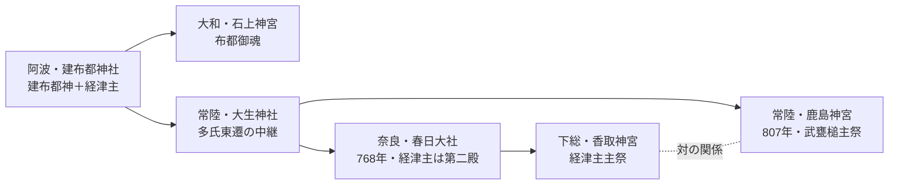

# 香取神宮の元宮論：経津主と阿波の刀剣祭祀

下総香取神宮の主祭神 **経津主神（フツヌシ）** は、阿波の **建布都神社**（阿波郡市場町）に祀られる **建布都神＝建御雷神** と同根の刀剣神であり、神武東征の「布都御魂」と直結する阿波の武神祭祀が本源である――この阿波説の主張を整理する。

> 📚 親ハブ: [[元宮ハブ_MOC]]
> 🔗 対の社: [[鹿島神宮の元宮と多氏の東遷]]（武甕槌）

## 概要

| 項目 | 内容 |
|---|---|
| 遷座先 | 香取神宮（千葉県香取市、下総一宮） |
| 阿波の元宮 | **建布都神社**（式内社・阿波国 阿波郡） |
| 阿波の鎮座地 | 阿波市市場町香美社本18 |
| 主祭神 | 経津主神（建布都神／建御雷神／伊都之尾羽張の子） |
| 主張根拠 | 全国唯一の「建布都神社」式内社、神武東征「布都御魂」霊剣下賜の物語、鹿島と対の関係 |
| 確度 | **★★（社伝＋系譜）** — 建布都＝経津主の式内社が阿波のみという制度的事実が強力 |

## 1. 経津主神（フツヌシ）とは

| 項目 | 内容 |
|---|---|
| 神名 | **経津主神**（ふつぬしのかみ） |
| 別名 | **建布都神**（たけふつのかみ）／**豊布都神**（とよふつのかみ） |
| 神格 | 刀剣の神、国譲りの武神 |
| 親神 | 伊都之尾羽張神（イツノオワバリ／天之尾羽張） |
| 兄弟・同神 | 建御雷神（タケミカヅチ）と一対 |
| 主要祭祀地 | 香取神宮（下総）／春日大社 第二殿（奈良）／石上神宮 |

## 2. 阿波の建布都神社：全国唯一の式内社

『延喜式神名帳』に記される **「阿波国 阿波郡 建布都神社」** は、**全国で唯一** 建布都神を社名に冠する式内社。

| 項目 | 内容 |
|---|---|
| 鎮座地 | 徳島県阿波市市場町香美社本18 |
| 社格 | 式内小社 |
| 祭神 | **建布都神・経津主命・大山祇命・事代主命** |
| 比定論社 | 建布都神社（市場町）、伊笠神社（伊笠山頂）、赤田神社、（合祀）八幡神社 |
| 立地 | 吉野川北岸、対岸に [[多祁御奈刀祢神社]]（諏訪大社元宮）を望む |
| Plus Code | 37MX+8H 阿波市、徳島県 |

→ 詳細：[[建布都神社]] ／ [[建布都神と阿波の武神伝承]]

### 「フツ」関連の阿波・伊予の式内社

| 神社名 | 国・郡 | 祭神 |
|---|---|---|
| **建布都神社** | 阿波国 阿波郡 | 建布都神 |
| **布都神社** | 伊予国 桑村郡 | 経津主神 |
| 石上神宮（参考） | 大和国 山辺郡 | 布都御魂大神 |

→ 阿波＋伊予（四国）に **「フツ」「布都」を冠する式内社が集中** している。

## 3. 神武東征「布都御魂」と阿波の建布都神

『古事記』神武東征段：皇軍が **熊野村** で大熊の邪気にかかって倒れた際、高倉下（タカクラジ）の夢に天照大御神が建御雷神に「**葦原中国はもともとおまえ一人が平定した国であるから、おまえが降るがよい**」と宣べ、霊剣 **布都御魂** を下した。

### 阿波説の比定

| 場面 | 通説 | 阿波説 |
|---|---|---|
| 熊野村 | 紀伊半島南部 | 阿波・**土成町高尾字熊之庄**（[[熊野三山の元宮論_阿波における原初熊野祭祀]]） |
| 高倉下の地 | 紀伊 | 阿波・**土成町高尾**（地名「高尾」が「タカクラジ」由来） |
| 布都御魂を授けた神 | 高天原の建御雷神 | 阿波・**建布都神社**の建布都神＝建御雷神 |
| 神武の橿原宮 | 大和橿原 | 阿波・土成町 **樫原神社**（神武天皇祭神） |

→ すなわち神武東征「布都御魂」の物語は **阿波・吉野川北岸で完結する** とし、霊剣を下した建御雷神（＝建布都神）の本拠地が **阿波郡市場町の建布都神社** であるという論理。

出典：awa_otoko_05_神社巡り#2015-01-13-高天原の武神_建御雷神（建布都神） （[出典](https://awa-otoko.hatenablog.com/entry/2015/01/13/232001)）

## 4. 鹿島・香取・大生の三角関係

```
【国譲り段】
  建御雷神（タケミカヅチ） ←→ 経津主神（フツヌシ）
            ┃                    ┃
       同一神（建布都神）の二面、または兄弟神
            ┃                    ┃
       阿波・建布都神社（一社で両神を祀る）
            ┃
【東遷】     ↓
  多氏（神八井耳命系）が祭祀者として東遷
            ↓
       大生神社（常陸潮来、110基の古墳群）
            ↓
【768年】 大生 → 春日 へ遷座
【807年】 春日 → 鹿島 へ再遷座（武甕槌）
       同時期、対の経津主が **香取神宮** に成立
```

→ **鹿島（武甕槌）と香取（経津主）の対** は、阿波・建布都神社で **一社にまとめられていた両神** が、東遷後に **下総の利根川を挟んで分祀された** 構造とみる。

## 5. 阿波説における「フツ」の語源と物部氏

- **「フツ」** ＝ 刀剣を振り下ろす音、または鋭利な音
- 物部氏の祖神 **布都御魂** は石上神宮の神宝（霊剣そのものを神格化）
- 阿波説では、**物部氏の本貫も阿波**（[[阿波物部氏：天村雲命を祖とする武人集団と鉄の支配]]）
- 阿波の建布都神社の祭神に **物部氏祖神** が含まれることは、物部氏が阿波で鉄剣祭祀を担い、後に大和（石上）→ 下総（香取）へ東遷したことを示唆

## 6. 香取神宮成立と阿波の遷座ルート



## 7. 残された課題

| 課題 | 内容 |
|---|---|
| 香取神宮の社伝 | 阿波由来を明記する一次史料が無い |
| 鹿島と香取の分化時期 | 阿波で一神だったものが、いつ二神に分化したか |
| 物部氏東遷ルート | 阿波 → 大和（石上）→ 下総（香取）の物証 |
| 経津主単独の阿波元宮 | 武甕槌（建御雷）と統合された祭祀が中心で、経津主単独の式内社は伊予桑村郡のみ |

## 関連ノート

- [[元宮ハブ_MOC]]（親ハブ）
- [[鹿島神宮の元宮と多氏の東遷]]（対の社）
- [[春日大社の元宮論_阿波忌部と中臣氏の本貫]]
- [[熊野三山の元宮論_阿波における原初熊野祭祀]]
- [[建布都神社]]
- [[建布都神と阿波の武神伝承]]
- [[阿波物部氏：天村雲命を祖とする武人集団と鉄の支配]]
- [[多祁御奈刀祢神社]]（吉野川対岸の対の社）
- awa_otoko_05_神社巡り#2015-01-13-高天原の武神_建御雷神（建布都神） （[出典](https://awa-otoko.hatenablog.com/entry/2015/01/13/232001)）

## 外部参考

- 香取神宮 公式：[https://katori-jingu.or.jp/](https://katori-jingu.or.jp/)
- 玄武神社（阿波の建布都神社）：[https://genbu.net/data/awa2/takefutu_title.htm](https://genbu.net/data/awa2/takefutu_title.htm)
- awa-otoko blog：[高天原の武神 建御雷神（建布都神）](https://awa-otoko.hatenablog.com/entry/2015/01/13/232001)
