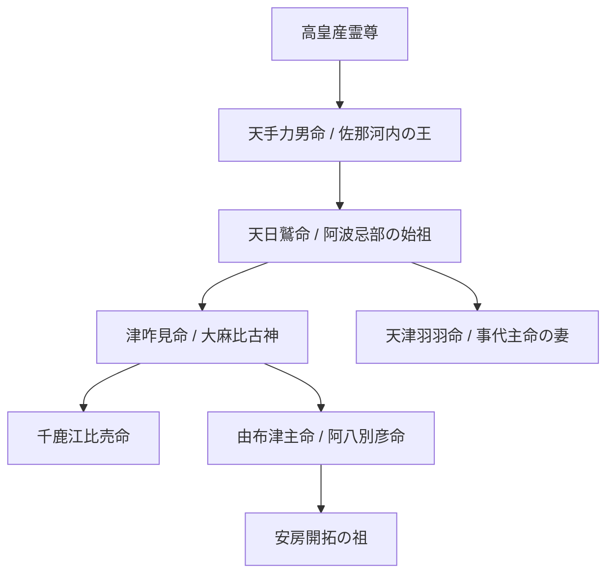

# 👥 阿波忌部の神系譜

← ポータルへ戻る

> [!summary] 要旨
> 阿波忌部の伝承に独自に伝わる **神系譜** を整理する。**高皇産霊尊─天手力男命─天日鷲命─津咋見命／天津羽羽命─千鹿江比売命・由布津主命** の系譜は、記紀の記述を **補完・修正** する阿波独自の体系であり、阿波忌部の **氏族的アイデンティティ** の中枢をなす。安房開拓の祖（由布津主命）への接続を含めた、阿波忌部の祖神系譜全体図を示す。

---

## 1. 系譜全体図

→ より広い文脈：[[阿波忌部氏伝承詳細]]

---

## 2. 各神の位置づけ

### 2-1. 高皇産霊尊（タカミムスビ）

天津神の祖。記紀においては天照大神と並ぶ高天原の根源神。阿波忌部の系譜では祖父神として最上位に位置する。

### 2-2. 天手力男命（アメノタヂカラオ）／佐那河内の王

- 記紀では天岩戸開きで岩戸を引き開けた怪力神。
- 『古事記』の決定的記述：「**手力雄命は佐那那縣に坐す**」──阿波佐那河内村にいたとされる。
- 阿波説では **佐那河内村の王** として位置づけられ、阿波忌部の祖父神とされる。

→ [[阿波説の根幹]]（高天原＝大川原高原、天岩戸＝天岩戸別神社）

### 2-3. 天日鷲命（アメノヒワシ）／阿波忌部の始祖

- 天岩戸開きで楽器を奉献し「鷲」の異名を得た祖神。
- 種穂山に天磐船で降臨し、五穀の種を蒔いて阿波を開拓した。
- 『古語拾遺』に明記される阿波忌部の祖。

→ [[天日鷲命：天岩戸の功績と「鷲」の由来]]、[[種穂山降臨：天磐船と五穀の種蒔き]]、[[忌部祖神：天日鷲命の降臨と神陵]]

### 2-4. 津咋見命（ツクイミ）／大麻比古神

- 阿波一宮 [[大麻比古神社]]（板野郡）の主祭神「大麻比古神」と同一視される。
- 「**大麻**」の名は阿波忌部の主産業である **麻** を象徴。
- 板野郡の祭祀拠点として、麻殖郡（忌部神社）と並ぶ阿波忌部の二大本拠地のうち一翼を担う。

### 2-5. 天津羽羽命（アマツハハ）／事代主命の妻

- 事代主命の妻として、出雲系の祭祀ネットワークに接続する。
- 阿波忌部と事代主系氏族（大国主の御子神）の通婚関係を示す。
- [[事代主神社]]（阿波郡市場町・勝浦郡）の祭祀と直結。

→ [[大国主命と天日鷲命：阿波忌部の祖神との同一視説]]

### 2-6. 千鹿江比売命（チカエヒメ）

- 津咋見命の御子神。
- 阿波の女性祭祀者として、忌部氏の祭祀継承の重要な位置を占める。

### 2-7. 由布津主命（ユフツヌシ）／阿八別彦命

- 津咋見命の子。**阿波忌部の東遷を率いた人物**。
- 別名 **阿八別彦命（あわけわけひこ）**──「阿波を分かれた彦」の意。
- 神武天皇の勅命を受けた **天富命** と並び、**安房開拓** の祖として房総半島に渡る。

→ [[阿波忌部の東遷：安房・上総開拓と黒潮ネットワーク]]、[[天富命の上陸と安房神社の創建]]

---

## 3. 系譜の独自性

阿波忌部の神系譜は、**記紀の記述を補完・修正** する点で重要な情報を含む。

| 観点 | 記紀の記述 | 阿波忌部伝承 |
|---|---|---|
| 天日鷲命の位置 | 中央忌部の祖の一人として簡略に記載 | 阿波の本貫祖神、系譜の中軸 |
| 天手力男命の所在 | 神話的属性として記述 | 佐那河内村の王として地名対応 |
| 大麻比古神 | 詳細な系譜は不明 | 津咋見命と同一視、麻の象徴 |
| 由布津主命 | 記紀には現れない | 安房開拓の祖、阿波→房総の東遷主導者 |

→ [[阿波忌部の東国痕跡：千葉・上総・安房の祭祀地名]]

---

## 4. 関連の祖父神・関連神格

- **天背男命**：阿波忌部の祖父神とされる。平田篤胤「一神異名」群の中心。
- **葦稲葉神**：天日鷲命の御子神（板野郡）。
- **大宜都比売命**：阿波の国魂（クニタマ）、忌部の祖神に隣接する女神。

→ [[天背男命：阿波忌部の祖父神と「一神異名」群]]、[[葦稲葉神：天日鷲命の御子神と板野郡の稲祭祀]]

---

## 5. 阿波説における意義

阿波忌部の神系譜は、阿波説の **以下の論点を体系化** する：

1. **天皇家祭祀との直結**：高皇産霊尊から天手力男命へ続く系譜は、阿波忌部が **天津神直系** の祭祀権を持つことを示す。
2. **記紀の補完**：阿波が記紀から消された後も、伝承系譜として原型が残存している。
3. **東遷の血統的根拠**：由布津主命＝阿八別彦命の存在が、阿波→房総の東遷を **氏族継承劇** として整序する。
4. **事代主系との通婚**：天津羽羽命を介して、出雲系祭祀ネットワークに接続する。

---

## 6. 関連ノート

- [[阿波忌部氏伝承詳細]]
- [[天日鷲命：天岩戸の功績と「鷲」の由来]]
- [[忌部祖神：天日鷲命の降臨と神陵]]
- [[種穂山降臨：天磐船と五穀の種蒔き]]
- [[阿波忌部の東遷：安房・上総開拓と黒潮ネットワーク]]
- [[天富命の上陸と安房神社の創建]]
- [[大麻比古神社]]
- [[忌部神社]]
- [[天背男命：阿波忌部の祖父神と「一神異名」群]]
- [[葦稲葉神：天日鷲命の御子神と板野郡の稲祭祀]]
- [[大国主命と天日鷲命：阿波忌部の祖神との同一視説]]

---

## 7. 留保

> [!warning] 注意
> - 本系譜は阿波の社伝・地誌に依拠し、**『古語拾遺』とも一部齟齬** を生じる。中央忌部（斎部氏）の系譜とは独立した阿波独自の体系であることに留意。
> - 「**由布津主命＝阿八別彦命**」「**津咋見命＝大麻比古神**」のような同一視は、いずれも阿波の社伝に依拠する。**統合された一本の系譜が文献的に確定しているわけではない**。
> - 記紀との補完関係を強調しすぎると「**阿波忌部の主張がすべて正しい**」前提に陥る危険がある。記紀・古語拾遺・阿波伝承の **三層を比較する** 史料批判が必要。

---
*※本稿は[[阿波忌部氏伝承詳細]]から詳細化・分割された専門論考である。*
