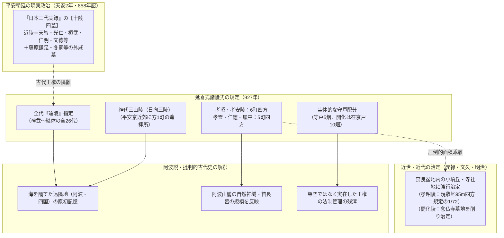

# 『延喜式』諸陵式における陵墓規定と「遠陵」の謎

> [!summary] 要旨
> 平安時代中期（延長5年・927年奏進、967年施行）の法典『**延喜式**』巻21「**諸陵式**」は、治部省諸陵寮が管轄する歴代天皇・皇族の山陵・墓について、所在国郡・等級（**近陵／遠陵**）・**兆域**（墓域面積）・**守戸数**（管理世帯）を網羅した最重要の国家法制記録である。
> 欠史八代を含む神武〜継体までの古代天皇はすべて「**遠陵（おんりょう）**」に指定され、特に第5代孝昭・第6代孝安天皇には全山陵中単独最大規模の「**東西六町・南北六町（約654m四方・約42.7ha）**」という巨大な兆域が定められている。
> 六国史（『日本三代実録』等）が示す通り、平安朝廷の「近陵」は天智系・光仁系皇統および藤原北家外戚（十陵四墓）に限定されており、古代大王たちは一括して「遠陵」へと隔離された。阿波古代史研究（Koraku/marine816ら）では、**「都から海を隔てた阿波・四国に原初墓域が存在した制度的残滓」「実体としての守戸・兆域を伴う実在の王権墓域」**と解釈し、現行の宮内庁治定地（奈良県内の小墳丘）との巨大な面積乖離（1/72）や神代三山陵の遙拝所規定から古代の地名スライド・王権移動の痕跡を読み解く。

---

## 1. 命題の構造と対比



| 観点 | 通説（歴史学・古代法制史） | 阿波説・批判的古代史（Korakuブログ等） |
|---|---|---|
| **「近陵／遠陵」の定義** | 現天皇からの世代的親疎（近親か遠祖か）、または「荷前（のさき）の使」直接派遣の有無に基づく儀礼区分 | 都（平安京／畿内）から海を隔てた遠隔地（四国・阿波）に本来の原初墓域があった記憶と制度の残滓 |
| **初期天皇の兆域規定** | 律令国家の権威付けのための観念的・誇大規定（実際の古墳規模とは無関係） | 実際に広大な山麓・神域（佐那河内・長国など）を持っていた阿波王権の祭祀スケールを反映 |
| **守戸（烟数）の配分** | 律令格式上の形式的な戸数割当 | 実体としての墓所・祭祀集団が存在したことの物証（架空の墓に税免除を伴う守戸を置く必然性はない） |
| **現治定地との乖離** | 平安〜幕末・明治の治定における誤認・仮治定 | 畿内（大和葛城等）ではなく阿波に本来の比定地が存在したことの間接的証明 |
| **神代三山陵の遙拝所** | 九州の遠隔地に対する遙拝規定 | 神話日向（阿波南部・橘湾〜津峯）の聖域に対する国家祭祀の継承 |

---

## 2. 平安朝廷の現実政治と「十陵四墓」の制定

『延喜式』諸陵式における「近陵／遠陵」の区分は、平安初期の皇統意識と藤原氏外戚政治の確立過程を直接反映している。

### 2-1. 『日本三代実録』に見る荷前使の対象（天安二年詔）
『日本三代実録』天安2年（858年）12月9日条に、平安朝廷が年末の「荷前（のさき）の幣」を直接奉献する対象を定めた決定的な詔勅が記録されている。

> **『日本三代実録』巻一 天安二年十二月九日条**
> 「詔定十陵四墓可獻年終荷前之幣。
> - 天智天皇 山階山陵（山城国宇治郡）
> - 春日宮御宇天皇（志貴皇子） 田原山陵（大和国添上郡）
> - 天宗高紹天皇（光仁天皇） 後田原山陵（大和国添上郡）
> - 贈太皇太后高野氏（高野新笠） 大枝山陵（山城国乙訓郡）
> - 桓武天皇 栢原山陵（山城国紀伊郡）
> - 贈太皇太后藤原氏（藤原乙牟漏） 長岡山陵（山城国乙訓郡）
> - 崇道天皇（早良親王） 八嶋山陵（大和国添上郡）
> - 先太上天皇（淳和天皇） 楊梅山陵（大和国添上郡）
> - 仁明天皇 深草山陵（山城国紀伊郡）
> - 文徳天皇 田邑山陵（山城国葛野郡）
> - ［墓］贈太政大臣正一位 藤原朝臣鎌足（多武峯墓、大和国十市郡）
> - ［墓］後贈太政大臣正一位 藤原朝臣冬嗣（宇治墓、山城国宇治郡）
> - ［墓］尚侍贈正一位 藤原朝臣美都子（次宇治墓、山城国宇治郡）
> - ［墓］贈正一位 源朝臣潔姫（愛宕墓、山城国愛宕郡）」

### 2-2. 近陵の政治的実態と古代天皇の遠陵化
1. **近陵の寡占**:
   - 荷前使（参議・公卿クラスの高官）が直接派遣される「近陵」は、**天智天皇 ➔ 光仁 ➔ 桓武 ➔ 仁明 ➔ 文徳へと直結する平安皇統、および藤原北家（鎌足・冬嗣・美都子）の外戚墓**に限定されていた。
2. **古代大王の完全隔離**:
   - 神武天皇、仁徳天皇、雄略天皇、継体天皇といった古代の強力な大王たちでさえ「近陵」には入らず、すべて「遠陵」として荷前使の直接奉幣から除外され、地方国司の管理に委ねられた。
   - この事実から、「遠陵」は単なる親疎関係にとどまらず、**「平安京の現行政治体制から切り離され、制度的に棚上げされた古い王権」の受皿**となっていたことがわかる。

---

## 3. 初期〜古代天皇（神武〜継体）の諸陵式データ一覧

『延喜式』諸陵式に記録された歴代天皇（第1代神武天皇〜第26代継体天皇、および神功皇后）の陵墓規定データ：

| 代・天皇名 | 諸陵式記載の陵名 | 所在国郡（延喜式） | 等級 | 規定兆域 | 守戸 | 宮（記紀） | 阿波比定地・関連論点（Koraku等） |
|---|---|---|---|---|---|---|---|
| **第1代 神武天皇** | 畝傍山東北陵 | 大和国高市郡 | **遠陵** | 東西一町・南北二町 | 守戸五烟 | 橿原宮 | 阿波市土成町樫原・眉山麓 |
| **第2代 綏靖天皇** | 桃花鳥田丘上陵 | 大和国葛上郡 | **遠陵** | 東西一町・南北一町 | 守戸五烟 | 葛城高丘宮 | 勝浦郡・立岩神社周辺 |
| **第3代 安寧天皇** | 畝傍山西南御陰井上陵 | 大和国高市郡 | **遠陵** | 東西三町・南北二町 | 守戸五烟 | 片塩浮孔宮 | 名西郡石井町・眉山西南井上郷 |
| **第4代 懿徳天皇** | 畝傍山南繊沙渓上陵 | 大和国高市郡 | **遠陵** | 東西一町・南北一町 | 守戸五烟 | 軽曲峡宮 | 徳島市寺山・城王古墳群 |
| **第5代 孝昭天皇** | **掖上博多山上陵** | 大和国葛上郡 | **遠陵** | **東西六町・南北六町** | 守戸五烟 | 掖上池心宮 | 名東郡佐那河内村（御間都比古神社） |
| **第6代 孝安天皇** | **玉手丘上陵** | 大和国葛上郡 | **遠陵** | **東西六町・南北六町** | 守戸五烟 | 室秋津島宮 | 阿南市室・牛岐・津峰周辺 |
| **第7代 孝霊天皇** | **片丘馬坂陵** | 大和国葛下郡 | **遠陵** | **東西五町・南北五町** | 守戸五烟 | 黒田廬戸宮 | 徳島市国府町西黒田・東黒田 |
| **第8代 孝元天皇** | 剣池嶋上陵 | 大和国高市郡 | **遠陵** | 東西二町・南北一町 | 守戸五烟 | 軽境原宮 | 麻殖郡・美馬郡（伊加加志神社周辺） |
| **第9代 開化天皇** | 春日率川坂上陵 | 大和国添上郡 | **遠陵** | 東西五段・南北五段 | **京戸十烟** | 春日率川宮 | 板野郡藍住町矢上春日・大麻町 |
| **第10代 崇神天皇** | 山邊道勾岡上陵 | 大和国城上郡 | **遠陵** | 東西二町・南北二町 | 守戸五烟 | 磯城瑞籬宮 | 美馬市穴吹町・式内倭大国魂神社 |
| **第11代 垂仁天皇** | 菅原伏見東陵 | 大和国添下郡 | **遠陵** | 東西二町・南北二町 | 守戸五烟 | 纏向珠城宮 | 名西郡神山町・天日鷲神・常世国祭祀 |
| **第12代 景行天皇** | 山邊道上陵 | 大和国城上郡 | **遠陵** | 東西二町・南北二町 | 守戸五烟 | 纏向日代宮 | 阿波市阿波町・日向行幸・伊予巡行 |
| **第13代 成務天皇** | 狭木楯列池後陵 | 大和国添下郡 | **遠陵** | 東西二町・南北二町 | 守戸五烟 | 志賀高穴穂宮 | 国造制確立・粟国造阿波忌部本拠 |
| **第14代 仲哀天皇** | 惠我長野西陵 | 河内国丹比郡 | **遠陵** | 東西二町・南北二町 | 守戸五烟 | 穴門豊浦宮 | 鳴門市撫養・熊野神社・海路親征 |
| **（神功皇后）** | 狭木楯列池上陵 | 大和国添下郡 | **遠陵** | 東西二町・南北二町 | 守戸五烟 | 磐余若桜宮 | 阿波市市場町・香美神社・三韓軍備 |
| **第15代 応神天皇** | 惠我藻伏崗陵 | 河内国志紀郡 | **遠陵** | 東西二町・南北二町 | 守戸五烟 | 軽島豊明宮 | 徳島市八幡町・日峰神社・八幡原初 |
| **第16代 仁徳天皇** | **百舌鳥耳原中陵** | 和泉国大鳥郡 | **遠陵** | **東西五町・南北五町** | 守戸五烟 | 難波高津宮 | 板野郡・吉野川下流治水・民のかまど |
| **第17代 履中天皇** | **百舌鳥耳原南陵** | 和泉国大鳥郡 | **遠陵** | **東西五町・南北五町** | 守戸五烟 | 磐余稚桜宮 | 阿南市・去来穂別尊・海部郡拠点 |
| **第18代 反正天皇** | 百舌鳥耳原北陵 | 和泉国大鳥郡 | **遠陵** | 東西三町・南北二町 | 守戸五烟 | 丹比柴籬宮 | 阿波郡柴神・多治比柴垣比定 |
| **第19代 允恭天皇** | 惠我長野北陵 | 河内国丹比郡 | **遠陵** | 東西三町・南北二町 | 守戸五烟 | 遠飛鳥宮 | 名東郡・盟神探湯・遠飛鳥比定 |
| **第20代 安康天皇** | 菅原伏見西陵 | 大和国添下郡 | **遠陵** | 東西五段・南北五段 | 守戸五烟 | 石上穴穂宮 | 穴穂宮・阿波忌部氏内訌 |
| **第21代 雄略天皇** | 丹比高鷲原陵 | 河内国丹比郡 | **遠陵** | 東西三町・南北三町 | 守戸五烟 | 泊瀬初瀬宮 | 稲荷山鉄剣獲加多支鹵・大長谷 |
| **第22代 清寧天皇** | 河内坂門原陵 | 河内国古市郡 | **遠陵** | 東西二町・南北二町 | 守戸五烟 | 甕栗宮 | 白髪皇子・播磨阿波探索譚 |
| **第23代 顕宗天皇** | 傍丘八釣山陵 | 大和国葛下郡 | **遠陵** | 東西二町・南北二町 | 守戸五烟 | 近飛鳥八釣宮 | 弘計王・縮見屯倉・播磨阿波避難 |
| **第24代 仁賢天皇** | 埴生坂本陵 | 河内国丹比郡 | **遠陵** | 東西二町・南北二町 | 守戸五烟 | 石上広高宮 | 億計王・石上神宮・物部祭祀 |
| **第25代 武烈天皇** | 傍丘磐坏丘北陵 | 大和国葛下郡 | **遠陵** | 東西二町・南北二町 | 守戸五烟 | 泊瀬列城宮 | 王朝断絶の画期・泊瀬伝承 |
| **第26代 継体天皇** | **三嶋藍野陵** | 摂津国嶋上郡 | **遠陵** | **東西三町・南北三町** | 守戸五烟 | 磐余玉穂宮 | 阿波本貫論・越前樟葉経由の大和入り |

※単位の目安：
- 1町 ≒ 約109m（60間）。1段（反）≒ 360歩（約1090㎡）。
- **6町四方**：約654m × 654m（約42.7ヘクタール、甲子園球場約11個分）
- **5町四方**：約545m × 545m（約29.7ヘクタール）
- **3町四方**：約327m × 327m（約10.7ヘクタール）

---

## 4. 「近陵（政治重視）」vs「遠陵（兆域最大）」の逆転構造

諸陵式のデータを精査すると、平安朝廷の政治的重要度と、記録された兆域（墓域面積）の間に**完全な逆転現象**が存在する。

| 区分 | 代表的な天皇 | 諸陵式の等級 | 荷前使の派遣 | 諸陵式の規定兆域 | 備考 |
|---|---|---|---|---|---|
| **平安朝の最重要皇統** | 天智天皇・桓武天皇 | **近陵** | **あり（公卿派遣）** | 東西二町・南北二町（〜三町） | 政治的には最優遇だが兆域は中規模 |
| **古代の最大王権** | 仁徳天皇・履中天皇 | **遠陵** | なし（常幣） | 東西五町・南北五町 | 巨大前方後円墳の実態を反映 |
| **記紀で事績のない天皇** | **第5代孝昭・第6代孝安** | **遠陵** | なし（常幣） | **東西六町・南北六町（最大！）** | **全26代中単独最大規模（42.7ha）** |

### 逆転の核心論理
1. **観念的創作説の破綻**:
   - もし平安時代の官人が単なる架空の権威付けで兆域を定めたのであれば、**近陵である天智・桓武陵を最大にし、事績のない孝昭・孝安を最小にするのが自然**である。
2. **古記録の忠実な継承**:
   - 政治的に冷遇された「遠陵」の孝昭・孝安陵に全陵中最大の「6町四方」が残存した理由は、**律令制以前から伝承されてきた「原初墓域の神域スケール（阿波山麓の広大な自然地形）」を、官人が改変できずにそのまま公的台帳に引き写したため**と解釈される。
3. **現行治定地（奈良県御所市）の矛盾**:
   - 現在の孝昭天皇陵（奈良県御所市三室）の敷地は**約95m四方（約0.9ha）**に過ぎず、延喜式規定（約654m四方・42.7ha）の**約72分の1**である。

---

## 5. 神代三山陵（日向三陵）と平安京遙拝所の分析

『延喜式』諸陵式の巻頭には、神武天皇以前の天孫・神代三代の陵墓が特異な形式で記録されている。

### 諸陵式の記載内容
1. **日向埃山陵（ひむかのえのみささぎ）**：天津彦瓊瓊杵尊（ニニギ）。「在日向国、無陵戸」。
2. **日向高屋山上陵（ひむかのたかやのやまのえのみささぎ）**：日子穂穂手見命（ホオリ・山幸彦）。「在日向国、無陵戸」。
3. **日向吾平山上陵（ひむかのあひらのやまのえのみささぎ）**：彦波瀲武鸕鶿草葺不合尊（ウガヤフキアエズ）。「在日向国、無陵戸」。

### 平安京における「方1町の遙拝所」
- 諸陵式本文には、これら神代三陵が遠隔の日向国にあり陵戸（守戸）が置かれていないため、**「山城国葛野郡田邑陵の南の原に方一町の地を画して遙拝所に当てられた」**と明記されている。
- **考察（Koraku等の視点）**:
  - 国家がわざわざ平安京郊外（葛野郡田邑＝清和天皇陵付近）に「方1町（約109m四方）」の土地を画定して遙拝所を設けた事実は、神代三代の墓が単なる神話ではなく、国家祭祀として実在視されていた証拠。
  - 阿波説では、この「日向」は南九州ではなく阿波南部（橘湾〜日峰山〜津峯山）の神話日向であり、海を隔てた本貫地に対する遙拝制度と解釈する。

---

## 6. 諸陵式に記載された皇族・有力者の「墓」と四国祭祀

諸陵式には、天皇・皇后の「陵」だけでなく、皇族・有力者の「墓」も記載されており、四国祭祀との深い連動が指摘される。

### ① 倭迹迹日百襲姫命（大坂墓・大和国城上郡）
- **諸陵式の規定**: 兆域 東西五段・南北五段、守戸一烟。
- **背景と四国祭祀**:
  - 孝霊天皇の皇女。通説では箸墓古墳に比定されるが、四国では**讃岐国一宮・田村神社（高松市）や水主神社（東かがわ市）の主祭神**として絶大な信仰を集める。
  - 讃岐平野の灌漑・水神祭祀を主導した実体があり、四国に本拠を置いた女王的性格を持つ。

### ② 彦坐王（真野墓・近江国滋賀郡）
- **諸陵式の規定**: 兆域 東西一町・南北一町。
- 開化天皇の皇子であり、丹波・但馬・北陸平定の祖。

---

## 7. 近世・近代における「修陵」の歴史と治定の限界

現在宮内庁が管理する天皇陵の多くは、古代から正確に伝承されてきたものではなく、近世〜近代の政治的意図によって治定された歴史を持つ。

```
江戸初期（荒廃・陵墓不明）
   ↓
元禄の修陵（1697〜1699年）：松下見林・細井広沢らの調査による治定
   ↓
文久の修陵（1862〜1865年）：幕末尊皇攘夷運動に伴う修復・治定
   ↓
明治の治定（1874年〜）：明治政府・教部省・宮内省による強行治定
   ↓
現在：考古学的年代の逆転・遺構不一致が判明しても「治定見直し拒絶（静安の保持）」
```

### Korakuブログ等が指摘する治定の実態
- **開化天皇陵（春日率川坂上陵）**:
  - 奈良市油阪町の「念仏寺山古墳」（墳丘長約100mの前方後円墳）に治定されているが、近世には念仏寺の墓地となっていた場所を幕末に寺院墓地を移転・墳丘を削って無理やり整備した。
- **考古学との年代逆転**:
  - 4世紀〜5世紀の前方後円墳に3世紀以前の初期天皇が割り当てられたり、円墳に前方後円墳が割り当てられるなど、考古学的事実との齟齬が全国で多発。
- **作家・井沢元彦らの批判**:
  - 「現代考古学で明らかに別人と判明している墓を天皇陵として祀り続けることは、皇祖先祖霊に対する侮辱である」とし、宮内庁の頑なな治定維持姿勢（宮内庁管理地の発掘不許可・治定不変更）が古代史解明を阻んでいると指摘されている。

---

## 8. 阿波説・四国論における統合的解釈

阿波古代史研究（Koraku/marine816、岩利大閑、大杉博ら）は、延喜式諸陵式の記述を以下のように総合的に位置づける。

1. **「大和国」記載と「遠陵」指定の二重性**:
   - 延喜式編纂時（10世紀）、政治的配慮から所在国は「大和国」と書き換えられたが、等級（遠陵）や兆域（6町四方）、守戸の規定には、**「かつて阿波・四国の広大な山麓・神域に存在した原初墓域」の規格がそのまま残存**した。
2. **阿波における地形・神社との完全一致**:
   - 第5代孝昭（掖上博多山上陵・6町四方） ➔ **佐那河内村の[[御間都比古神社]]**（観松彦色止命を祀る全国唯一社）と広大な山岳神域。
   - 第6代孝安（玉手丘上陵・6町四方） ➔ **阿南市室・津峰山麓**の海洋王権拠点。
   - 第7代孝霊（片丘馬坂陵・5町四方） ➔ **徳島市国府町西黒田・東黒田・天佐自能和氣神社**。
   - 第8代孝元（剣池嶋上陵） ➔ **吉野川市川島町・式内社[[伊加加志神社]]**（皇后・伊香色謎命を祀る全国唯一社）。
   - 第9代開化（春日率川坂上陵） ➔ **板野郡藍住町矢上春日神社**（6世紀屯倉跡・春日祭祀の原点）。
3. **『先代旧事本紀』国造本紀との整合**:
   - 孝昭天皇の9世孫が阿波南部の「長国造」に任じられた記録と合致し、阿波の在地首長層が代々奉斎した広大な兆域が「6町四方」の根拠となった。

---

## 9. 留保（学術的中立性の確保）

> [!warning] 注意
> - **制度史の通説**: 歴史学における定説では、「遠陵」は都からの物理的距離ではなく、**天皇親王の喪葬令・儀式における世代的親疎（現天皇から離れた遠祖）に基づく等級区分**と解釈されている。
> - **兆域の誇大性**: 諸陵式の兆域数値は、平安時代の律令官人が古記録や格式に基づいて観念的に割り振ったものであり、必ずしも実際の墳丘実測値を示すものではないとする見解が強い。
> - **国郡の記載**: 延喜式諸陵式本文には、神武〜開化の陵の所在国としてすべて「大和国（高市郡・葛上郡・葛下郡・添上郡）」と明記されており、阿波国・四国とは書かれていない。阿波説の解釈は「記述の背景にある原初記憶の投影」を想定する二次的推論である。
> - 本ノートの evidence_type は "primary_source_based"、confidence は 3。

---

## 10. 関連ノート（Vault内）

- [[欠史八代：阿波・四国に残る実在の足跡]] — 欠史八代の親ハブ
- [[欠史八代の阿波比定論：宮・陵・妃の地名対応一覧]] — 全代の宮・陵・后妃対応一覧
- [[四国全域における欠史八代の足跡]] — 四国広域展開と祭祀分布
- [[第5代-孝昭天皇：御間都比古神社と佐那河内の「御間」王権]] — 6町四方の兆域を持つ掖上博多山上陵
- [[第6代-孝安天皇：秋田（アキタ）から室（ムロ）へ、海洋勢力との結節点]] — 6町四方の兆域を持つ玉手丘上陵
- [[第7代-孝霊天皇：四国広域支配と桃太郎伝説の源流]] — 5町四方の兆域を持つ片丘馬坂陵
- [[第8代-孝元天皇：阿波君のルーツと土着勢力の再編]] — 伊加加志神社・物部氏の祖系
- [[第9代-開化天皇：伊加々志神社と物部王権の確立]] — 春日率川坂上陵と藍住矢上
- [[長国（南阿波）：ヤマト王権への抵抗と海洋勢力の拠点]] — 長国造と観松彦系譜
- 延喜式神名帳：阿波五十座の全容 — 延喜式の神名帳編

---

## 11. 参考文献・史料

- 『延喜式』巻21「治部省 諸陵寮 諸陵式」（延長5年・927年奏進）
- 『日本三代実録』巻1（天安2年・858年十二月九日条、荷前十陵四墓詔）
- 『先代旧事本紀』巻10「国造本紀」
- 『日本書紀』・『古事記』各帝紀陵墓条
- 宮内庁諸陵寮編『諸陵要覧』
- 井上光貞・関晃・土田直鎮・青木和夫校注『律令』（日本思想大系、岩波書店）
- koraku（marine816）ブログ「欠史八代 考察」シリーズ・「神代三山陵考察」
- 井沢元彦『逆説の日本史』古代編
- 岩利大閑『道は阿波より始まる』
- 髙木隆弘『記・紀の説話は阿波に実在した』
