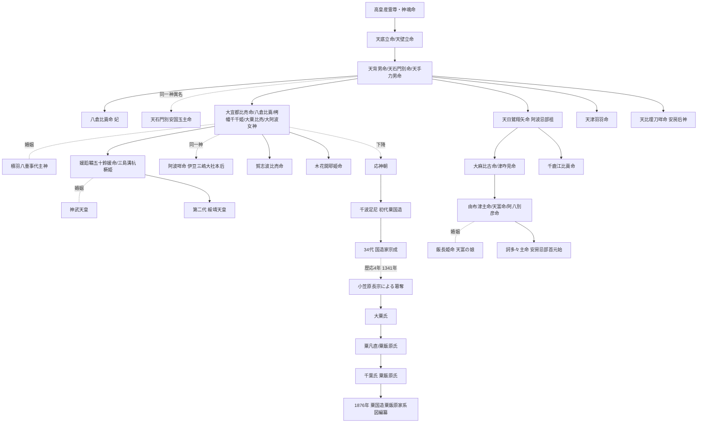

# 大宜都比売命家系図：粟国造粟飯原家系図と神系譜の総合

> [!summary] 要旨
> **『粟国造粟凡直粟飯原氏系図』**（1876年・明治9年成立）を中軸資料として、**大宜都比売命（オオゲツヒメ）を起点とする家系図** を総合する。本系図は **「粟国開主大宜都比売神」を遠つ祖** とし、**応神朝の千波足尼を初代国造**、**34代まで祭官を継承**（1341年・歴応4年に小笠原長宗に祭官職を奪われる）、**粟凡直→粟飯原氏→千葉氏接続** に至る系譜を伝える。**goutara ブログ「まとめ：大宜都比売命の裔」シリーズ全12回**（2016年5月〜12月）が本系図と関連史料を網羅的に解読しており、本ノートはその統合版。**通説（『古事記』伊邪那岐・伊邪那美の御子）** と **阿波説（天手力男命の御子・栲幡千千姫命と同一）** の二系譜を整理し、**「大宜都比売 ＝ 八倉比賣 ＝ 大阿波女神 ＝ 阿波咩命 ＝ 三島溝杭橛姫」** の同一神異名群、および **配偶神 ＝ 積羽八重事代主神** を中心軸に、阿波・伊豆・畿内・房総を統合する祭祀ネットワークを系譜化する。

---

## 1. 命題の構造

| 観点 | 通説 | 阿波説 |
|---|---|---|
| **父神** | 伊邪那岐命 | **天手力男命（＝天石門別神）** |
| **母神** | 伊邪那美命 | 八倉比賣命（または同一神） |
| **位置** | 国生み所産の地方神 | **阿波国の国魂神＝大阿波女神** |
| **配偶神** | 不明 | **積羽八重事代主神** |
| **同一神** | – | 八倉比賣命・大粟比売・大阿波女神・阿波咩命・三島溝杭橛姫 |
| **子孫氏族** | 不在 | **粟凡直 → 粟飯原氏 → 千葉氏** |
| **東遷** | – | **伊豆三嶋大社へ** |

---

## 2. 中核資料

### 2-1. 『粟国造粟凡直粟飯原氏系図』（1876年）

| 項目 | 内容 |
|---|---|
| **正式名** | **粟国造粟凡直粟飯原氏系図** |
| **成立年** | **明治9年（1876年）** |
| **所蔵** | 阿波の粟飯原家（明治期、徳島県立文書館に資料群伝承） |
| **要点** | **「遠ツ祖ハ粟國開主大宜都比売神ナリ」** と明記 |
| **本姓主張** | 粟凡直（あわのおおしのあたい）姓、粟国造の末裔 |

→ 詳細：[[12_粟飯原家文書_概要]]、[[粟国造と大粟・粟飯原氏：国魂神を奉斎し続けた正統なる土着王権]]、[[大粟氏・粟飯原氏：祭祀一族の系譜と八倉比賣神社継承の闘い]]

### 2-2. 関連史料群

| 資料 | 内容 |
|---|---|
| **『上一宮大粟神社古傳書及御神号改正願稿』**（明治25年） | 父神論の核心資料 — **「天石門別ノ四字ハ御父ノ御名」**、栲幡千千姫命＝大宜都比売命 |
| **『阿波女社宮主祖系』** | 34代祭官名を記録（百年前に消失） |
| **『大粟比賣尊考證』**（大粟氏編纂） | **「大宜都比売命ハ高皇産霊尊御子ニテ粟国造粟凡直等之遠祖也」** |
| **『斎部宿祢本系帳』** | 天背男命の后神 八倉比賣命を記す → 大宜都比売命の母神論に接続 |
| **『藤原氏本系帳』** | 玉主命（=天背男命）の娘・許登能麻遅命の系譜 |
| **『古屋家家譜』** | 天石門別安国玉主命の妻神＝八倉比賣命 |
| **『阿波国風土記編輯雜纂』** | 天津國玉神＝父神説 |
| **『復姓証左書』**（明治14年） | 粟飯原氏の粟凡直姓主張の証文 |

### 2-3. goutara ブログ「まとめ：大宜都比売命の裔」シリーズ

千波足尼研究の goutara（ぐーたら気延日記）が2016年5月〜12月に **全12回** で展開した連載：

| 回 | 主要内容 |
|---|---|
| 前置1（2015-10） | **「大宜都比売は二度死ぬ」** — 古事記（須佐之男に殺害）と日本書紀（月読命が保食神を殺害）の同一神話、**月夜見命＝建速須佐之男命** の同一視 |
| 前置2（2015-11） | **「大宜都比売は阿波の國魂」** — 国魂神論 |
| 前置3（2016-01） | **「上一宮大粟神社古傳書及御神号改正願稿」** — 明治期社名改正抗議文書の詳細、大粟氏・氏子の系譜主張 |
| 1（2016-05） | **「粟国造粟凡直粟飯原氏系図」** 本格分析開始、応神朝・千波足尼任命、34代祭官、1341年の小笠原長宗による祭官職簒奪 |
| 6 | 福家清司（元徳島教育長）論文『阿波国一宮社と「国造」伝承』を参照、**月読命＝須佐之男命**、**大宜都比売命＝大阿波女神**、**配偶 ＝ 事代主神** |
| 9 | 明治14年『復姓証左書』、粟飯原氏の **古代氏族末裔説 vs 平氏千葉氏流説** の二説混在 |
| 12 | **大宜都比売命＝阿波咩命** として **伊豆三嶋大社遷座**、**三嶋大社本后＝三島溝杭橛姫大神**、**神武天皇王妃 媛蹈鞴五十鈴媛命の母神** 仮説 |

→ シリーズURL基点：[https://goutara.blogspot.com/2016/05/blog-post.html](https://goutara.blogspot.com/2016/05/blog-post.html)

---

## 3. 大宜都比売命の異名群（一神異名）

『粟国造粟飯原家系図』および関連史料が伝える大宜都比売命の **異名（同一神とされる神格）**：

| 異名 | 出典 | 性格 |
|---|---|---|
| **大宜都比売神** | 『古事記』（粟国の別名） | 阿波国の国魂神 |
| **大粟比売命** | 上一宮大粟神社主祭神 | 阿波の粟祭祀の中心 |
| **大阿波女神** | 粟国造粟飯原家系図 | 阿波の女神 |
| **八倉比賣命** | 天石門別八倉比賣神社祭神 | 大宜都比売命の母神 or 同一神（諸説） |
| **栲幡千千姫命** | 『古傳書改正願稿』 | 天手力男命の御子、大宜都比売命の異名 |
| **保食神（うけもち）** | 『日本書紀』 | 月読命に殺害される五穀の神 |
| **阿波咩命** | 伊豆三嶋大社系 | 三嶋大社本后、伊豆神階帳の「一品きさきの宮」 |
| **三島溝杭橛姫大神** | 伊豆三嶋大社系 | 神武天皇王妃の母神（仮説） |
| **長濱の御前** | 阿波神社（伊豆） | 三嶋大社本后の伊豆比定 |

→ **「一神を多名で語る」** という阿波・忌部・粟国造系祭祀の伝統。

---

## 4. 神話的家系図：三層の系譜

### 4-1. 第一層：通説（『古事記』伊邪那岐系）

```
伊邪那岐命 ─── 伊邪那美命
        │
        ├─ 淡道之穂之狭別嶋
        ├─ 伊予二名嶋（四国）
        │      │
        │      ├─ 愛媛（伊予）
        │      ├─ 飯依比古（讃岐）
        │      ├─ 大宜都比売（阿波・粟国）  ← 国生み所産の神格化
        │      └─ 建依別（土佐）
        └─ …
```

→ 通説では **「阿波国の別名そのもの」** が大宜都比売命。地方神。

### 4-2. 第二層：阿波説（『古傳書改正願稿』の父神論）

```
天手力男命（＝天石門別神／天背男命／一神異名群）
   ┃ 配偶神：八倉比賣命（亦名 大宜都比売命？）
   ┃
   ┣━━ 栲幡千千姫命（＝大宜都比売命 異名）
   ┃        ┃
   ┃        ┗━━ 配偶神：積羽八重事代主神
   ┃                  ┃
   ┃                  ┗━━ 御子：媛蹈鞴五十鈴媛命（神武天皇王妃）
   ┃                  ┗━━ 御子：賀志波比売命（仮説）
   ┃                  ┗━━ 御子：木花開耶姫命（仮説）
   ┃
   ┣━━ 天日鷲翔矢命（阿波忌部の祖）
   ┃        ┃
   ┃        ┗━━ 大麻比古命（亦名 津咋見命）
   ┃
   ┣━━ 天津羽羽命（事代主の妻）
   ┗━━ 天比理刀咩命（天太玉命の后神）
```

→ 阿波説では大宜都比売命は **天手力男命と八倉比賣命の御子**、配偶神は **積羽八重事代主神**。

→ 詳細：[[大宜都比売命の父神論：天手力男・天背男・八倉比賣との交差]]、[[大宜都比売命の系譜：高皇産霊尊の御子としての正体]]

### 4-3. 第三層：高皇産霊系（『大粟比賣尊考證』）

```
高皇産霊尊
   │
   ├── 大宜都比売命（御子）
   │     ↓
   │   粟国造の遠つ祖
   │
   └── 栲幡千千姫命（高皇産霊神の娘）← 通説別伝
         │
         配偶：天忍穂耳命
         │
         天孫降臨へ
```

→ 大粟氏の主張：**「高皇産霊尊御子ニテ粟国造粟凡直等之遠祖也」**

→ 詳細：[[大宜都比売命の系譜：高皇産霊尊の御子としての正体]]

---

## 5. 大宜都比売命と事代主神の婚姻

### 5-1. goutara シリーズの中核命題

『粟国造粟飯原家系図』および関連伝承が伝える：

> **大宜都比売命の配偶神は積羽八重事代主神**（つみはやえことしろぬしのかみ）

これは阿波説の **最重要婚姻**：

| 観点 | 内容 |
|---|---|
| **大宜都比売命** | 阿波の **国魂神（女神）** |
| **積羽八重事代主神** | **海洋王権の象徴神**、出雲系祭祀の中核 |
| **意義** | **阿波と出雲の祭祀統合**、**国譲り神話の阿波内完結** |

→ 詳細：[[積羽八重事代主神と阿波：大宜都比売命の配偶神としての海洋王権]]

### 5-2. 御子神の系譜

大宜都比売命と事代主神の御子としての可能性が指摘される神：

| 御子 | 性格 | 出典 |
|---|---|---|
| **媛蹈鞴五十鈴媛命** | **神武天皇の王妃** | 三嶋大社系伝承、goutara第12回 |
| 賀志波比売命 | 阿波・若杉山系祭祀 | [[大宜都比売命の娘世代と三世代祭祀構造：賀志波比売・木花開耶姫]] |
| 木花開耶姫命 | 富士山系祭祀（東遷後） | 同上 |
| 三島溝杭橛姫 | 伊豆三嶋大社の本后 | goutara 第12回 |

→ これにより **大宜都比売命 → 媛蹈鞴五十鈴媛命 → 神武天皇王妃** という系譜が **阿波で初代天皇王妃の母系を完結** させる。

---

## 6. 月読命＝須佐之男命との関係

### 6-1. 「大宜都比売は二度死ぬ」の論

goutara シリーズ前置1（2015-10）の核心：

| 出典 | 神話 |
|---|---|
| **『古事記』** | **須佐之男命** が大宜都比売を殺害、五穀を生じさせる |
| **『日本書紀』** | **月読命** が保食神を殺害、五穀を生じさせる |

→ **同一神話の主役入れ替わり** が確認される。これは「**月読命 ＝ 須佐之男命**」とする系図上の同一視を生む。

### 6-2. 阿波の月信仰との接続

| 観点 | 内容 |
|---|---|
| **月読命** | 阿波（特に西阿波）の月信仰の中心 |
| **須佐之男命** | 出雲系祭祀の暴神 |
| **同一視** | **阿波の月信仰 ＝ 出雲系神格の阿波内変奏** |

→ 詳細：[[月読尊と大宜都比売命：『月』の名を冠する女神と西阿波の月信仰]]

---

## 7. 人代の家系図：粟国造から粟飯原氏へ

### 7-1. 神代から人代への接続

```
大宜都比売命（粟国開主）
        │
        │ ……世代……
        │
   応神朝（4世紀後半〜5世紀初頭）
        │
第1代  千波足尼（ちはのすくね）── 初代粟国造
        │
        │ ……34代継承……
        │
第34代 国造家宗成
        │
        │ 歴応4年（1341年）
        │ 小笠原長宗による祭官職簒奪
        ↓
   大粟氏として継承
        │
        │ 中世
        ↓
   粟凡直 → 粟飯原氏（あいばらうじ）
        │
        │ 中世末〜近世
        ↓
   千葉氏との接続（千葉粟飯原氏）
        │
        │ 江戸期 三日月・粟飯原家
        ↓
   明治9年（1876年）『粟国造粟凡直粟飯原氏系図』編纂
   明治14年『復姓証左書』
   明治25年『古傳書及御神号改正願稿』
```

→ 詳細：[[粟国造と大粟・粟飯原氏：国魂神を奉斎し続けた正統なる土着王権]]、[[大粟氏・粟飯原氏：祭祀一族の系譜と八倉比賣神社継承の闘い]]

### 7-2. 千波足尼の任命（応神朝）

| 項目 | 内容 |
|---|---|
| **時期** | **応神天皇治世**（4世紀後半〜5世紀初頭、伝） |
| **任命者** | 応神天皇 |
| **任命地** | 阿波国（粟国） |
| **後嗣** | 34代まで祭官職継承 |

→ 「**千波足尼**」は「**千葉**」の地名語源とする説もある（粟飯原氏の謎①千葉の地名の由来？粟国造・千波足尼 未知の駅 總フサ）。

### 7-3. 1341年の祭官職簒奪

| 項目 | 内容 |
|---|---|
| **年** | **歴応4年（1341年）** |
| **時代** | 南北朝期 |
| **簒奪者** | **小笠原長宗** — 信濃源氏小笠原氏の阿波入部 |
| **対象** | 第34代国造家宗成 |
| **結果** | 祭官職が小笠原氏に移行 |

→ これ以降、**大粟氏は祭祀から実質排除** され、近世まで在地豪族として残る。

### 7-4. 千葉氏との接続

| 観点 | 内容 |
|---|---|
| **粟飯原氏** | 阿波の粟凡直系統 |
| **千葉粟飯原氏** | 房総の千葉氏一族 |
| **接続論** | 阿波忌部の安房東遷時に粟飯原氏も同行、千葉氏の遠祖となった |
| **家紋** | 千葉氏の月星紋・九曜紋との関連 |

→ 詳細：[[粟飯原氏：千葉氏との繋がりと妙見・月信仰の系譜]]、[[3_粟飯原姓の誕生と長宗我部・蜂須賀期の没落]]

### 7-5. 二系統の混在（goutara第9回）

goutara 第9回が指摘する **二系統の混在**：

| 説 | 内容 |
|---|---|
| **古代氏族末裔説** | **粟凡直**（あわのおおしのあたい）を祖とする粟国造末裔 |
| **平氏千葉氏流説** | **桓武天皇** から始まる平氏系統への系図 |

→ 著者（goutara）は **家紋や伝わる文書から判断して「古代氏族末裔説は伝承」**、実際には **千葉氏流である可能性** を示唆。

→ ただし阿波説的には、**二系統の混在自体が阿波→安房の二重東遷を裏付ける** とも読める。

---

## 8. 伊豆三嶋大社への東遷（goutara 第12回）

### 8-1. 「大宜都比売命＝阿波咩命」の伊豆遷座

| 観点 | 内容 |
|---|---|
| **三嶋大社祭神** | **積羽八重言代主大神**（事代主） |
| **本后** | **三島溝杭橛姫大神** |
| **比定** | 阿波の大宜都比売命と同一 |
| **伊豆神階帳** | **「一品きさきの宮」** が阿波咩命を指す可能性 |
| **長濱の御前** | 阿波神社（伊豆）に祀られる、三嶋大社本后比定 |

→ **大宜都比売命 → 事代主と婚姻 → 伊豆へ東遷 → 三嶋大社本后** という壮大な系譜物語。

### 8-2. 媛蹈鞴五十鈴媛命との母子関係

goutara 第12回の仮説：

> **三島溝杭橛姫大神 ＝ 神武天皇王妃 媛蹈鞴五十鈴媛命の母神**

→ つまり：

```
大宜都比売命（＝三島溝杭橛姫）
   ┃ × 積羽八重事代主神
   ┃
   ┗━━ 媛蹈鞴五十鈴媛命
              ┃ × 神武天皇
              ┃
              ┗━━ 第二代 綏靖天皇
```

→ **阿波の国魂神が初代神武天皇の岳母** となる、阿波説の壮大な命題。

### 8-3. 阿波・伊豆・畿内の祭祀統合

| 地域 | 神 | 関係 |
|---|---|---|
| **阿波** | 大宜都比売命（粟国魂） | 起点 |
| **伊豆** | 三島溝杭橛姫（三嶋大社本后） | 東遷 |
| **畿内** | 媛蹈鞴五十鈴媛命（神武王妃） | 御子 |

→ 阿波説の「**四大柱**」のうち **「①神話舞台移動論」と「④地名と氏族の東遷法則」** を統合する系譜。

→ 関連：[[積羽八重事代主神と阿波：大宜都比売命の配偶神としての海洋王権]]

---

## 8-bis. fusa「粟飯原氏の謎②」の独自解読

『粟国造粟飯原氏系図』の **fusa（總フサ）ブログによる詳細翻刻と独自解釈** は、本系図研究の中で最も詳しい資料の一つ。基盤資料：**『四国中世史研究第7号 阿波国一宮社と「国造」伝承──「粟国造粟飯原氏系図」を素材として』** （徳島県立図書館所蔵）。

→ 関連：粟飯原氏の謎② 阿波粟飯原氏と八倉比賣神社 前編 未知の駅 總フサ、粟飯原氏の謎② 阿波粟飯原氏と八倉比賣神社 後編 未知の駅 總フサ

### 8-bis-1. 系図全翻刻：神代縦系譜

『粟国造粟凡直粟飯原氏系図』本文：

```
伊邪那岐神・伊邪那美神
   ↓
撞賢木厳之御魂天疎向津比賣命
（亦御名 天照大日孁貴命 / 天照大御神 / 天照坐皇大御神 / 大日孁貴命
 / 豊日孁命 / 此者洗給左御目之時所成神也 / 天皇之御祖）
   ↓
月夜見命
（亦御名 健速須佐之男命 / 神速須佐之男 / 勝速日命 / 熊野加武呂命
 / 熊野加夫呂岐櫛御気野命 / 速須佐良命 / 此者洗給右御目之時所成神也
 / **粟国造粟凡直等此大神之御末系也**）
   ↓
八嶋士奴美神
（亦御名 清之繋名坂軽彦八嶋午神 / 清之湯山主三名挟漏彦八嶋篠神
 / 清之湯山主三名挟漏彦八嶋野神 / 八束水臣津野神 / 淤美豆奴神
 / 御合稲田比賣命而所生之神也）
   ↓
天之冬衣神（亦云 天葺根神）
   ↓
大国主神
（亦御名 大名牟遅神 / 国造大三貴神 / 葦原醜男神 / 八千矛神
 / 宇都志国玉神 / 大地主神 / 大名持神
 / 御母刺国大之神之女刺国若比賣命
 / 大国御魂神（倭神社・荒魂） / 大物主櫛甕玉命（大三幹神社・和魂））
   ↓
積羽八重言代主神
（亦云 天事代主神 / 都波八重事代主神
 / 御母 身形之辺津宮坐多岐津比賣命
 / **故言代主神者粟国造粟凡直等之祖也**）
   ┃
   ┃ 后神：粟国魂大宜都比賣神
   ┃ （亦御名 大阿波女神 / 阿波女神 / 阿波波神 / 阿波神
   ┃  / 天津羽羽神 / 天石門別八倉比賣神 / 天石門別豊玉姫神
   ┃  / 天津石門別稚姫神 / 稚日女命 / 栲幡千々姫命 / 天御梶姫命
   ┃  / **故大宜都比賣者天之御中主神之子 / 皇産霊神之子
   ┃     / 角凝魂命之子 / 天午刀男神之女
   ┃     / 粟国造粟凡直等所産神是也**
   ┃  / 今名西郡神領村上一宮大粟大明神也）
```

→ **「言代主神者粟国造粟凡直等之祖也」** と **「大宜都比賣者粟国造粟凡直等所産神」** が両方明記。粟国造は **「事代主の末裔」かつ「大宜都比売の所産」** という **両系譜の統合継承者** として位置付けられる。

### 8-bis-2. 系図の御祖略系（縦軸の補足）

> 御祖略系
> 天之御中主神
>    ↓
> 皇産霊二大神（神皇産霊尊・高皇産霊尊）
>    ↓
> 角凝魂命
>    ↓
> 天午刀男神
>    ├→ 天日鷲神（粟忌部之祖、式内麻植郡忌部神社）
>    │      ├→ 大麻比古神（式内板野郡大麻比古神社）
>    │      ├→ 長白羽神
>    │      └→ 天羽槌雉神
>    ├→ 天鈴杵命 → 天御雲命 → 天村雲命 → 天波與命
>    │      （式内麻植郡天村雲伊自波庭比賣神社二座）
>    ├→ 許登能麻遅比賣命
>    └→ **大阿波女神**（大宜都比賣命）

→ **天午刀男神（=天手力男）の御子に大阿波女神（大宜都比賣命）** が明記されており、[[大宜都比売命の父神論：天手力男・天背男・八倉比賣との交差]] の核心命題と完全に整合する。

### 8-bis-3. 同御系神等（横展開：事代主と大宜都比売の御子神）

積羽八重言代主神と本后・大宜都比賣神の御子神：

```
物忌奈命
（亦御名 葦稲羽神 / 坐大粟山大神之摂社若宮明神
 / 亦坐板野郡神宅村葦稲羽明神）
   ──── 葦稲羽神＝宇迦之御魂神の別名でもある
   ──── 東京都神津島の「物忌奈神社」は三嶋神と本后・阿波咩命の御子神

若室神
（粟国造也 / 葦稲羽神必當同神 / **八倉比賣神社宮主**）
   ──── 正式名は「久久紀若室葛根神」
   ──── 大年神（=天兒屋根命）の子・羽山戸神と大宜都比賣の子説

玉依毘賣命（**天忍穂耳命の后神**）

多岐津比古命（二柱神名不詳）
   ──── 五柱神は本后大宜都比賣神との所生

天之八現津彦命
（御合 三嶋之溝咋耳命之女 溝咋比賣（亦名 活玉依毘賣）而所生之神
 / 長公長秡・孫土佐国造等之祖
 / **即當国勝浦郡百姓長直氏之祖**）

塩冶毘古命 → 焼太刀火守大穂日子命
```

→ **物忌奈命＝葦稲羽神** は [[葦稲葉神：天日鷲命の御子神と板野郡の稲祭祀]] と直結。

→ **天之八現津彦命の母が活玉依毘賣** で、**勝浦郡長直氏の祖**。勝浦郡（阿波）は **長氏（長国造）** の本拠。

→ 詳細：[[積羽八重事代主神と阿波：大宜都比売命の配偶神としての海洋王権]]

### 8-bis-4. 神名添書の独自解釈：百嶋神社考古学

fusa は **百嶋由一郎の神社考古学** をベースに、神名添書の独自解釈を展開：

#### 「世襲職名」説の核心命題

| 神名 | fusaの解釈 |
|---|---|
| **「大国主」** | **世襲職名**（代々の継承名） |
| **「事代主」** | **世襲職名**、**8代継承されたため「八重事代主」** と命名 |
| **「月夜見」** | **役職名の可能性**（スサノオ → 天兒屋根命など継承） |
| **「天日鷲」** | **継承される名** の可能性 |
| **「大宜都比咩」** | **象徴名**（特定氏族のリーダー女神） |

→ **添書きには代々その役職についていた人物の情報がまとめて記録**されているとする独自解釈。

#### 「事代主」8代の比定（fusaの仮説）

「大宜都比咩」名の8人の女神（事代主の妃たち）：

| # | 妃神 | 対応する事代主 |
|---|---|---|
| 1 | アカル姫（豊玉彦の姉） | スサノオ |
| 2 | 市杵島姫 | ナガスネヒコ |
| 3 | 豊受大神 | 大山咋 |
| 4 | 豊玉姫 | 大直根子 |
| 5 | 鴨玉依姫 | アジスキタカヒコネ |
| 6 | 活玉依姫 | 天兒屋根 |
| 7 | 栲幡千々姫 | – |
| 8 | 下照姫 | – |

→ **「事代主」職に就いた8人の人物名と、その妻となった8人の女神名** が圧縮記録されているとする読み。

#### fusaの神名比定一覧

| 系図の神名 | fusa比定 |
|---|---|
| **撞賢木厳之御魂天疎向津比賣命** | **大日孁貴命 ＝ 卑弥呼** |
| **月夜見命** | **スサノオ**（または継承名） |
| **八嶋士奴美神** | **大国主 ＝ ナガスネヒコ** |
| **天之冬衣神** | **大山咋** |
| **天午刀男神** | **スサノオ** |
| **大麻比古神** | **天太玉 ＝ 豊玉彦** |
| **長白羽神** | **天白羽鳥 ＝ 天物知命 ＝ 天忍日** |
| **天羽槌雉神** | **木花咲耶姫**（天日鷲の兄弟または嫁） |
| **天鈴杵命** | **大直根子（大田田根子）** |
| **天御雲命** | **天香山 ＝ 高倉下** |

### 8-bis-5. 「佐人＝千波足尼」隠匿説（fusa後編）

系図の神代以降、若室神から続く子孫の流れの **9世代目「佐人」の添書き**：

> **千波足尼ハ佐人又ハ前後ニアル神人中ノ必別名也**

→ つまり **「千波足尼は佐人またはその前後の神人の必別名」** という重要記述。

#### fusaの隠匿説解釈

> 何者かに命を脅かされていたら、本来の身分を隠すのは自然な事。それでも子孫に伝えたい真実がある時、**文字で残すことはできず一子相伝の口承のみで継承された**。
>
> 出雲振根が改竄された歴史に対抗して **代々一子相伝の口承のみで出雲族の歴史を継承** したように、藤原氏に祭祀権を奪われてしまった忌部の部民も迫害され漂泊の民となった。
>
> **「佐人」が「千波足尼」だという事実が文字で残る事を避けて、口承で残された**のかもしれない。

→ **粟飯原氏の本来の系譜が「佐人」表記で隠匿された**とする解釈。**「千波足尼」と「佐人」は別表記の同一人物**。

### 8-bis-6. 「八倉比賣＝天照大神」改竄説（fusa独自）

3論社（上一宮大粟・一宮神社・八倉比賣）の祭神比定を整理すると：

| 社 | 祭神 |
|---|---|
| **上一宮大粟神社** | 大宜都比売命（亦名 天石門別八倉比売命・大粟比売命） |
| **一宮神社** | 大宜都比売命・天石門別八倉比売命 |
| **八倉比賣神社** | **八倉比売命 ＝ 天照大神の別名** |

→ 公式比定では **「大宜都比売命＝天石門別八倉比売命＝大粟比売命＝天照大神」**。

→ fusa の独自主張：

> **八倉比売命を天照大神の別名としているのは真実を知られたくない人達による改竄**

→ つまり **「大宜都比売命＝天石門別八倉比売命＝大粟比売命」の三者は同一だが、天照大神は別** とする立場。八倉比賣神社の現行祭神比定は政治的改竄と読む。

### 8-bis-7. 「役職名」vs「象徴名」の二層構造

fusa の神名理論：

| 種別 | 例 | 性格 |
|---|---|---|
| **世襲職名** | 大国主、事代主、月夜見、天日鷲 | **複数代の人物が同じ名を継承**、添書きはその総合記録 |
| **象徴名** | 大宜都比咩、八倉比賣 | **特定氏族のリーダー女神の象徴**、複数の女神に重ねて使用 |

→ これにより **「同一神異名群」の構造的解釈** が可能となる。

→ **「それぞれの氏族系図によって『中の人』は異なっている」** とする多元的視点。

### 8-bis-8. 1341年祭官職簒奪と明治の復権運動

系図記載：

> 宮主であったという式内社・八倉比賣神社を **暦応4年（1341）に小笠原宮内大輔長宗に奪われた**

→ fusa の解釈：

> 明治になり神仏分離令などが布告され神道に再び光が当てられた際、**先祖が奉斎していた御祭神を取り戻そうとした**。**忌部は古代から祭祀を司った一族**で、**自分たちのアイデンティティを取り戻したかった**。

→ 阿波粟飯原氏が **「中世に千葉一族と共に渡ってきた」** という郷土史家の定説に対し、fusa は：

> **逆ではないか？** — 戦国期に落人となり本姓を隠していた人が明治になって元の姓に戻す事例（明智光秀の子孫など）と同様、**阿波粟飯原氏も事情により長く「千葉一族」と偽っていたのを明治の世になり正当な出自を認めてもらおうとした**のではないか。

→ **「源平藤橘に結び付けるならまだしも長く住んできた土地の国造の末裔だなんてウソはつかない」** という主張。これは [[粟飯原氏：千葉氏との繋がりと妙見・月信仰の系譜]] の千葉氏流説と **対立する重要論点**。

---

## 9. 統合家系図（試案）



---

## 10. 阿波説における意義

### 10-1. 「神 → 氏族 → 中世」を一本で繋ぐ

『粟国造粟飯原家系図』は、**「大宜都比売命（神代）→ 千波足尼（応神朝）→ 34代国造（神代から中世前期）→ 粟飯原氏（中世）→ 千葉氏（中世以降）→ 明治編纂」** という **「神話・古代・中世・近代」の四層を一本の血統で繋ぐ** 稀有な系図。

→ これは [[安房国忌部家系：高山家伝承と由布津主命の系譜]]（神代5世代）よりも **時代スパンが長大**。

### 10-2. 阿波・伊豆・畿内・房総の祭祀統合

大宜都比売命を中軸とすると：

| 地域 | 祭祀 | 神 |
|---|---|---|
| **阿波（本貫）** | 上一宮大粟神社・天石門別八倉比賣神社 | 大宜都比売命・八倉比賣命 |
| **伊豆** | 三嶋大社・阿波神社 | 阿波咩命・三島溝杭橛姫 |
| **畿内** | 神武天皇王妃 | 媛蹈鞴五十鈴媛命 |
| **房総** | 粟飯原氏 → 千葉氏 | 大粟比売継承 |

→ **大宜都比売命が古代日本の祭祀ネットワーク中枢** に位置することの系譜的証拠。

### 10-3. 「国譲り神話の阿波内完結」

| 観点 | 内容 |
|---|---|
| **大宜都比売命** | 阿波の国魂神（女神） |
| **積羽八重事代主神** | 出雲系祭祀の中核（男神） |
| **婚姻** | 阿波と出雲の祭祀統合 |
| **意義** | **国譲り神話の登場神格がすべて阿波で完結** |

→ 阿波説の **「神話舞台移動論」（四大柱の①）** の核心。

### 10-4. 二度の死と五穀起源

大宜都比売命が **二度死ぬ**（『古事記』須佐之男に殺害、『日本書紀』月読命が保食神を殺害）こと：

- **五穀起源神話の中核**
- **農業祭祀の起源**
- **大嘗祭・新嘗祭の根源神**

→ 阿波忌部の **麻・穀栽培の祭祀根拠** が大宜都比売命の死から生じる五穀起源神話に立脚する。

→ 関連：[[大宜都比売命と古代産業独占：麻・絹・五穀による経済基盤]]、[[大嘗祭と麁服（あらたえ）_天皇即位に必須の阿波の神布]]

### 10-5. 1341年の祭祀権簒奪と現代への接続

| 時期 | 出来事 |
|---|---|
| 応神朝〜1341年 | **34代継承**（千波足尼〜国造家宗成） |
| **1341年（歴応4年）** | **小笠原長宗による祭官職簒奪** |
| 中世〜近世 | 大粟氏として在地豪族 |
| 明治3年（1870） | 上一宮大粟神社 → **埴生女屋神社** 改名命令 |
| 明治9年（1876） | **粟国造粟飯原氏系図** 編纂 |
| 明治14年 | **復姓証左書** 作成 |
| 明治25年 | **古傳書及御神号改正願稿** 提出 |

→ **「神代から明治期の権利復権運動まで」一貫して大宜都比売命の祭祀権** を主張し続けた粟飯原氏の歴史。

→ 詳細：[[4_明治期の社名改正運動と『改正願稿』の抵抗]]

---

## 11. 関連神格・関連氏族

### 系図の主要神格
- [[大宜都比売命（オオゲツヒメ）]] — 中軸
- [[八倉比賣命：阿波最高神階を授かった謎の女神]] — 母神 or 同一神
- [[天背男命：阿波忌部の祖父神と「一神異名」群]] — 祖父神（一神異名群の中軸）
- 天手力男命（＝天石門別神）— 父神
- 積羽八重事代主神 — 配偶神
- [[天日鷲命：天岩戸の功績と「鷲」の由来]] — 兄弟神
- 月読命／須佐之男命 — 殺害者（神話上）
- 媛蹈鞴五十鈴媛命 — 娘（仮説）
- 三島溝杭橛姫 — 伊豆同一神
- 阿波咩命 — 伊豆比定名
- 賀志波比売命・木花開耶姫命 — 娘世代

### 主要氏族
- 粟国造 — 神代から派生
- 千波足尼 — 初代国造
- 粟凡直（あわのおおしのあたい）— 古代姓
- 粟飯原氏 — 中世以降
- 大粟氏 — 在地豪族
- 千葉氏 — 房総接続
- 小笠原氏 — 簒奪者
- 阿波忌部 — 並行祭祀系統

### 関連神社
- [[上一宮大粟神社：阿波国魂・大宜都比売命の中心祭祀]]
- [[天石門別八倉比売神社]]
- 三嶋大社（伊豆）
- 阿波神社（伊豆）
- [[安房神社]]
- [[忌部神社]]

---

## 12. 関連ノート（Vault内）

### 系譜・神格
- [[大宜都比売命（オオゲツヒメ）]] — 親ノート
- [[大宜都比売命の父神論：天手力男・天背男・八倉比賣との交差]]
- [[大宜都比売命の系譜：高皇産霊尊の御子としての正体]]
- [[大宜都比売命：阿波国の国魂神としての根源的権威]]
- [[大宜都比売命と天照大神：阿波における重層的な女神崇拝の構造]]
- [[大宜都比売命の娘世代と三世代祭祀構造：賀志波比売・木花開耶姫]]
- [[月読尊と大宜都比売命：『月』の名を冠する女神と西阿波の月信仰]]
- [[積羽八重事代主神と阿波：大宜都比売命の配偶神としての海洋王権]]
- [[八倉比賣命：阿波最高神階を授かった謎の女神]]
- [[天背男命：阿波忌部の祖父神と「一神異名」群]]

### 氏族論
- [[粟国造と大粟・粟飯原氏：国魂神を奉斎し続けた正統なる土着王権]]
- [[大粟氏・粟飯原氏：祭祀一族の系譜と八倉比賣神社継承の闘い]]
- [[粟飯原氏：千葉氏との繋がりと妙見・月信仰の系譜]]
- [[3_粟飯原姓の誕生と長宗我部・蜂須賀期の没落]]
- [[4_明治期の社名改正運動と『改正願稿』の抵抗]]
- [[5_県立文書館『粟飯原家文書』の学術検証]]

### 安房・房総接続
- [[安房国忌部家系：高山家伝承と由布津主命の系譜]]
- [[安房齋部本系帳：洲宮神社小野家伝承と天背男命の系譜]]
- [[👥 阿波忌部の神系譜]]
- [[阿波忌部の東遷：安房・上総開拓と黒潮ネットワーク]]
- [[天富命]]

### 関連史料
- [[12_粟飯原家文書_概要]]
- [[15_忌部氏系図・氏文]]
- 阿波国風土記_詳細

### 産業・経済基盤
- [[大宜都比売命と古代産業独占：麻・絹・五穀による経済基盤]]
- [[大嘗祭と麁服（あらたえ）_天皇即位に必須の阿波の神布]]
- [[大宜都比売の民の東進：東阿波型土器と結晶片岩の考古学的証拠]]

### 伊豆接続
- 2023-06-28-鳥の一族　19_-_⑤　伊豆_長浜神_阿波咩命・阿波波神_阿波比売命

### 阿波説総合
- [[阿波説の根幹]]
- [[阿波説タイムライン]]
- 阿波説ポータル

### 参照ブログ・Web資料
- [https://goutara.blogspot.com/2016/05/blog-post.html](https://goutara.blogspot.com/2016/05/blog-post.html) — まとめ：大宜都比売命の裔（1）
- [https://goutara.blogspot.com/2016/06/blog-post.html](https://goutara.blogspot.com/2016/06/blog-post.html) — 大宜都比売命の裔（6）
- [https://goutara.blogspot.com/2016/06/blog-post_24.html](https://goutara.blogspot.com/2016/06/blog-post_24.html) — 大宜都比売命の裔（9）
- [https://goutara.blogspot.com/2016/12/12.html](https://goutara.blogspot.com/2016/12/12.html) — 大宜都比売命の裔（12）
- [https://goutara.blogspot.com/2015/10/blog-post.html](https://goutara.blogspot.com/2015/10/blog-post.html) — 前置1「大宜都比売は二度死ぬ」
- [https://goutara.blogspot.com/2016/01/blog-post_13.html](https://goutara.blogspot.com/2016/01/blog-post_13.html) — 前置3「上一宮大粟神社古傳書及御神号改正願稿」
- 2016-05-22-粟凡直粲胤_粟飯原家略傳を見よ！！
- 2016-08-13-安房千葉氏と阿波粟飯原氏にまつわる天女伝説
- 2016-11-09-千葉家系図_全：粟飯原氏の系譜
- 粟飯原氏の謎①千葉の地名の由来？粟国造・千波足尼 未知の駅 總フサ
- 粟飯原氏の謎② 阿波粟飯原氏と八倉比賣神社 前編 未知の駅 總フサ
- 粟飯原氏の謎② 阿波粟飯原氏と八倉比賣神社 後編 未知の駅 總フサ
- 粟飯原氏の謎③ 千葉粟飯原氏と千葉氏 未知の駅 總フサ

### 主要史料
- 『粟国造粟凡直粟飯原氏系図』（1876年）
- 『大粟比賣尊考證』（大粟氏編）
- 『上一宮大粟神社古傳書及御神号改正願稿』（明治25年）
- 『阿波女社宮主祖系』（消失）
- 『斎部宿祢本系帳』
- 『藤原氏本系帳』
- 『古屋家家譜』
- 『阿波国風土記編輯雜纂』
- 福家清司『阿波国一宮社と「国造」伝承』
- 『古事記』『日本書紀』

---

## 13. 留保（中立的併記）

> [!warning] 注意
> - 『粟国造粟凡直粟飯原氏系図』は **明治9年（1876年）成立** で、それ以前の原本は確定していない。明治期の **家名復活運動の文脈** で編纂された側面がある
> - **「大宜都比売命 ＝ 八倉比賣 ＝ 三島溝杭橛姫 ＝ 阿波咩命」** とする同一神異名群は阿波説的読みで、各神格を **別神** と見る通説もある
> - **「配偶神 ＝ 積羽八重事代主神」** とする伝承は粟飯原家系図と goutara シリーズの解読に依拠する。記紀本文の直接的記載はない
> - **「媛蹈鞴五十鈴媛命の母神」** とする三嶋大社系比定は goutara 第12回の **仮説段階** で、著者自身が「時代考証の不足」を認めている
> - **「月読命 ＝ 須佐之男命」** の同一視は粟飯原家系図独自の主張で、神話学的には議論あり
> - **「千波足尼」の歴史性** は確定していない。応神朝の人物として伝承されるが、考古学的物証は限定的
> - 粟飯原氏は **「古代氏族末裔説」と「平氏千葉氏流説」の二系統が混在** しており、どちらが本来かは確定していない
> - 本ノートは **goutara シリーズ全12回および前置3回の統合版** だが、個別記事の細部までは網羅していない
> - 本ノートのevidence_typeは "primary_source_based"、confidence は4（高位）— 『粟国造粟飯原家系図』という具体的物的史料が存在するため

---

*※本稿は[[大宜都比売命（オオゲツヒメ）]]の系譜統合版として、[[大宜都比売命の父神論：天手力男・天背男・八倉比賣との交差]]・[[大宜都比売命の系譜：高皇産霊尊の御子としての正体]]の上位ハブとして機能する。安房側系譜は [[安房国忌部家系：高山家伝承と由布津主命の系譜]]・[[安房齋部本系帳：洲宮神社小野家伝承と天背男命の系譜]] を参照。*
