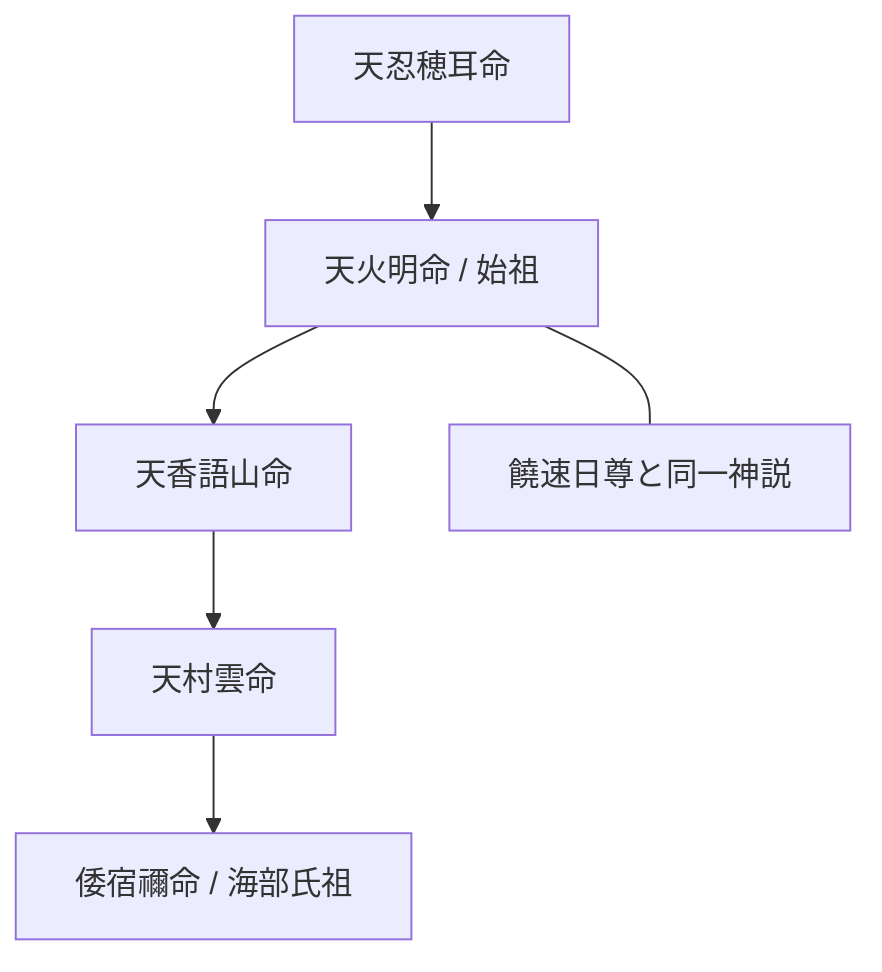

# 天火明命（アメノホアカリ / 彦火明命）

阿波から丹後、そして尾張へと繋がる巨大な氏族「海部氏・尾張氏」の始祖。阿波説において、天孫降臨の真の主役とされることもある神。

---


---

## 🏛 天火明命（アメノホアカリ）：詳細論考ポータル

以下の各論点は、独立した専門ノートとして詳細化されている。


### [[真の天孫降臨説|1. 真の天孫降臨説]]
ブログの考察（「鳥の一族 17」など）によれば、天照大神の神勅を受けて地上へ降臨した真の天孫は、ニニギ尊ではなく、その兄である**天火明命**であったとする説が...


### [[海部氏勘注系図の重要性|2. 海部氏勘注系図の重要性]]
京都府宮津市の籠神社に伝わる日本最古の系図。...


## 3. 系譜図


---


### [[関連する神社|4. 関連する神社]]
- 籠神社（丹後）：海部氏の本拠地。...


### 参照資料
- 2012-11-02-鳥の一族　17　天火明命...

## ⛩ この神を祉る式内社

> 祥序: frontmatter `deities` または `aliases` に「天火明」を含む阿波国式内社を自動抽出

```dataview
TABLE 旧郡, 座数, deities, file.folder AS フォルダ
FROM "式内社"
WHERE contains(string(deities), "天火明") OR contains(string(aliases), "天火明")
SORT 旧郡 ASC
```
