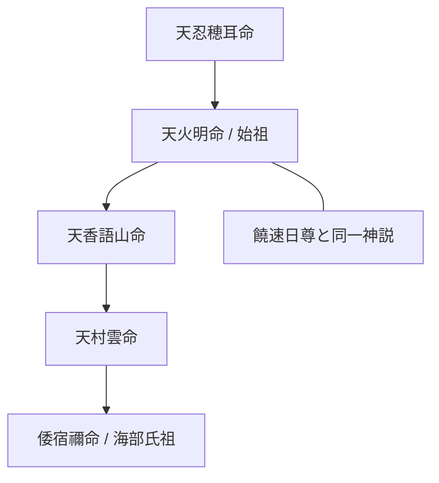

# 天火明命（アメノホアカリ / 彦火明命）

> [!summary] 要旨
> 天火明命（あめのほあかり）は、記紀において天孫族の系譜に連なり、海部氏・尾張氏の始祖と仰がれる神である。『日本書紀』『新撰姓氏録』では尾張連らの祖とされ、丹後・籠神社の海部氏「勘注系図」がその系譜伝承を伝える。阿波説では、天孫降臨の主役を弟ニニギではなくこの天火明命に求め、さらに物部氏の祖神・饒速日（ニギハヤヒ）と同一神とみる伝承を重ねて、阿波を起点に丹後・尾張へ広がった海人系王権の始祖として位置づける。記紀の系譜上の事実と、阿波説固有の「真の天孫」比定とは区別して読む必要がある。

阿波から丹後、そして尾張へと繋がる巨大な氏族「海部氏・尾張氏」の始祖。阿波説において、天孫降臨の真の主役とされることもある神。

---

## 1. 基本情報

| 項目 | 内容 |
|---|---|
| 主な異表記 | 天火明命 / 彦火明命 / 天照国照彦天火明命 / 天照国照彦火明命 |
| 系譜（記紀） | 天忍穂耳命の子（『日本書紀』一書では瓊瓊杵尊の兄、あるいは子とも） |
| 奉斎氏族 | 尾張連・海部直など（『新撰姓氏録』『先代旧事本紀』） |
| 主要文献 | 『日本書紀』神代、『新撰姓氏録』、『先代旧事本紀』、海部氏勘注系図 |
| 同一神説 | 物部氏祖神・饒速日尊（ニギハヤヒ）と同神とする説（阿波説・在野説） |

## 2. 命題の構造

| 論点 | 通説（記紀・学界） | 阿波説の主張 |
|---|---|---|
| 天孫降臨の主役 | 瓊瓊杵尊（ニニギ）が高千穂へ降臨 | 兄である天火明命こそ真の天孫であった |
| 起点の地 | 日向・高天原系の神話空間 | 阿波を起点に丹後・尾張へ展開 |
| 饒速日との関係 | 別神（物部氏の祖）とするのが一般的 | 天火明命と饒速日は同一神 |

---

## 3. 詳細論考ポータル

以下の各論点は、独立した専門ノートとして詳細化されている。

### [[真の天孫降臨説|3-1. 真の天孫降臨説]]
ブログの考察（「鳥の一族 17」など）によれば、天照大神の神勅を受けて地上へ降臨した真の天孫は、ニニギ尊ではなく、その兄である**天火明命**であったとする説が...

### [[海部氏勘注系図の重要性|3-2. 海部氏勘注系図の重要性]]
京都府宮津市の籠神社に伝わる日本最古の系図。...

## 4. 系譜図

---

### [[関連する神社|5. 関連する神社]]
- [[籠神社]]（丹後）：海部氏の本拠地。...

### 参照資料
- 2012-11-02-鳥の一族　17　天火明命...

## 6. 関連ノート（Vault内）
- [[籠神社]]（丹後）：海部氏の本拠地。天火明命系譜を伝える勘注系図を蔵する。
- [[天忍穂耳命]]：記紀系譜における父神。
- [[天太玉命]]：忌部氏祖神。阿波の天孫系祭祀との接点。

## 7. 留保

> [!warning] 注意
> - **通説**：天火明命は記紀・『新撰姓氏録』において尾張連・海部直らの祖神として確実に位置づけられる。系譜上の異伝（瓊瓊杵尊の兄か子か）は記紀の段階で既に揺れている。
> - **阿波説固有の主張**：「天孫降臨の真の主役は天火明命」「饒速日と同一神」「阿波を起点とする」といった比定は、記紀本文に明記された事実ではなく、海部氏勘注系図の解釈や在野ブログ（「鳥の一族」等）に依拠する仮説である。
> - 饒速日＝天火明命同一神説は『先代旧事本紀』を根拠に古くから論じられるが、学界では確定説ではない。
> - evidence_type: `blog_hypothesis` / confidence: 2（記紀の系譜事実は堅いが、阿波起点・真の天孫という核心命題は阿波説固有の飛躍が大きい）。

## 8. この神を祀る式内社

※ deities または aliases に「天火明」を含む阿波国式内社

現在、deities／aliases に「天火明」を含む阿波国の式内社は登録されていない。天火明命は丹後（籠神社）・尾張を本拠とする海部氏・尾張氏の始祖神であり、阿波国内の式内社の主祭神としては確認されていない。
