**水若酢神社。**

島後の北西、郡に鎮座。

式内名神大社　水若酢神社に比定される神社で、隠岐国一の宮とされる神社。

戦前は国幣中社、現在は神社本庁の別表神社。

## 境内

[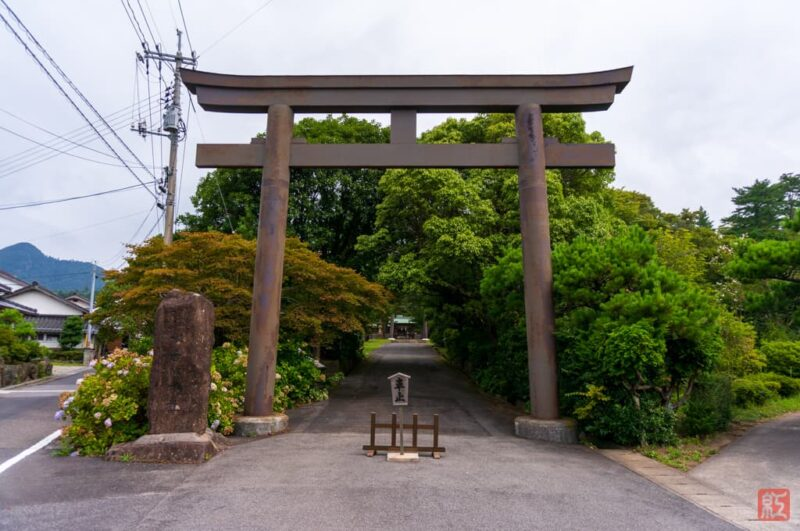](https://momijiaoi.net/wp-content/uploads/2021/06/mizuwakasu2015083030.jpg)

一の鳥居

[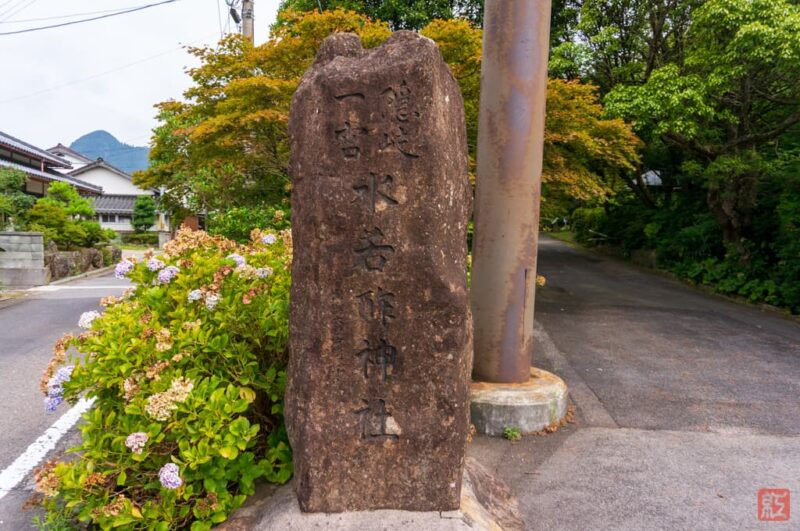](https://momijiaoi.net/wp-content/uploads/2021/06/mizuwakasu2015083031.jpg)

社号標

[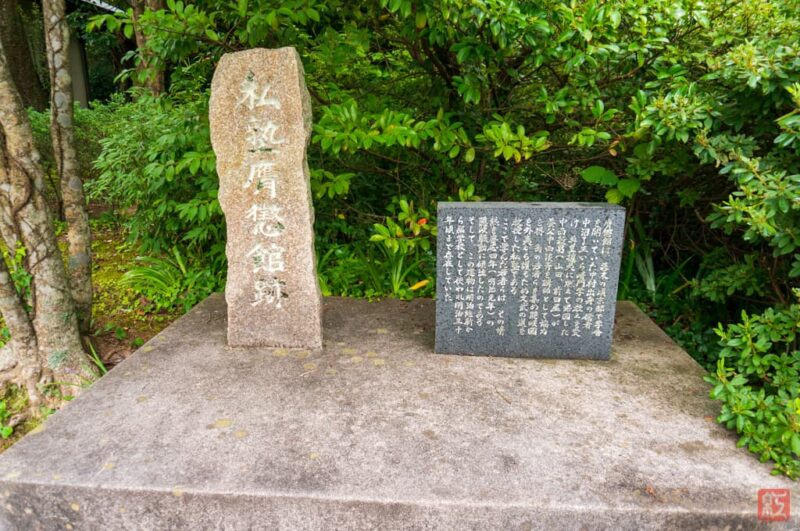](https://momijiaoi.net/wp-content/uploads/2021/06/mizuwakasu201508301.jpg)

私塾膺懲館跡

膺懲館は、幕末の頃京都で学舎を開いていた中村出身の儒者中沼了三から崎門学の教えを受け、尊王攘夷に燃えて帰国した中西穀男（山田、前田屋）が養父中西淡斉を講師として協力を得、島の若者らを集め隠岐国を外夷から護るため文武の道を教授した私塾である

ここで学んだ若者らは、その情熱を慶応四年（明治元年）の隠岐騒動に傾注したのである

そして、この建物は明治維新から郡学校として使われ明治三十年頃まで存在していた

[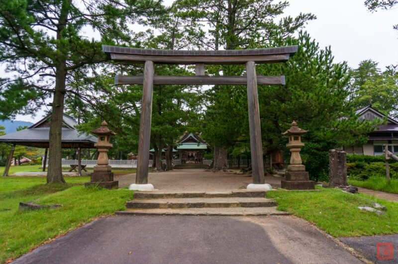](https://momijiaoi.net/wp-content/uploads/2021/06/mizuwakasu201508302.jpg)

二の鳥居

[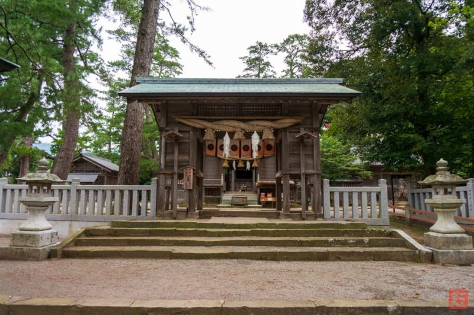](https://momijiaoi.net/wp-content/uploads/2021/06/mizuwakasu201508303.jpg)

神門

[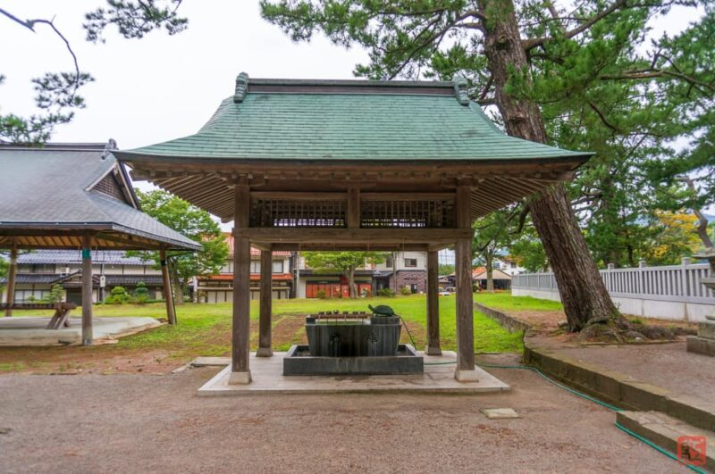](https://momijiaoi.net/wp-content/uploads/2021/06/mizuwakasu201508304.jpg)

手水舎

## 社殿

[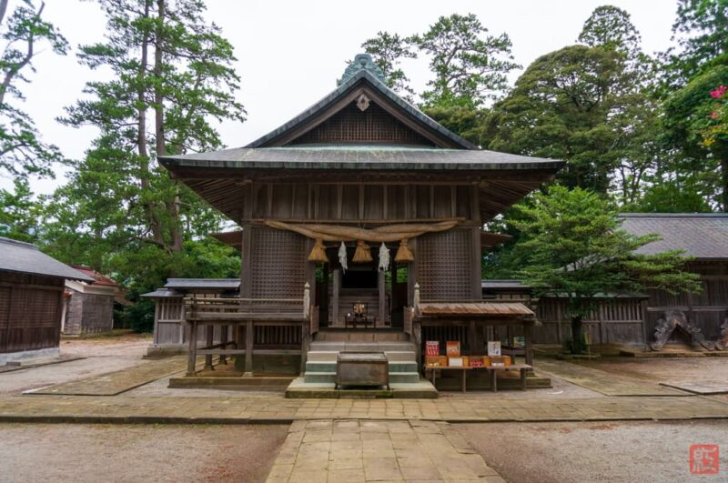](https://momijiaoi.net/wp-content/uploads/2021/06/mizuwakasu2015083010.jpg) [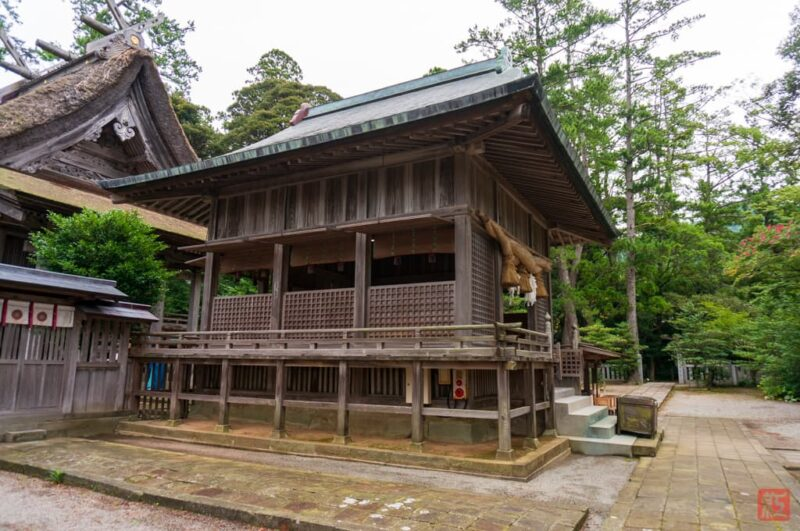](https://momijiaoi.net/wp-content/uploads/2021/06/mizuwakasu201508307.jpg)

拝殿

[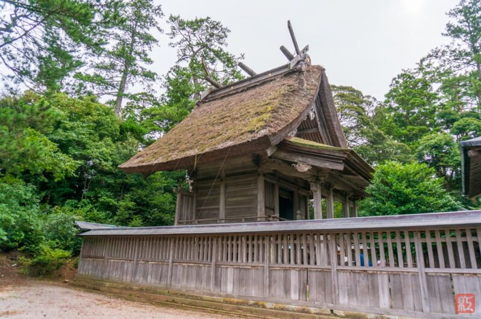](https://momijiaoi.net/wp-content/uploads/2021/06/mizuwakasu201508308.jpg) [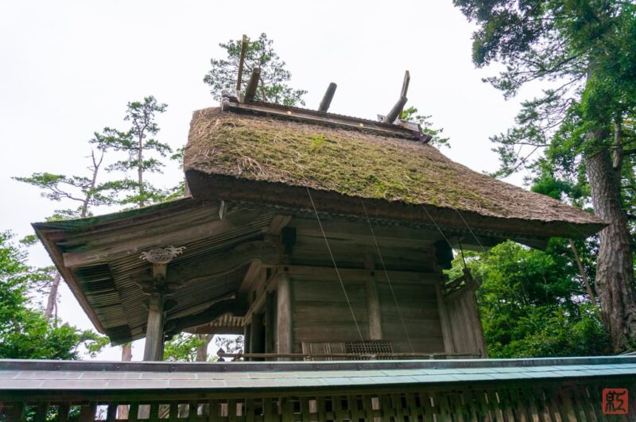](https://momijiaoi.net/wp-content/uploads/2021/06/mizuwakasu2015083012.jpg)

本殿

[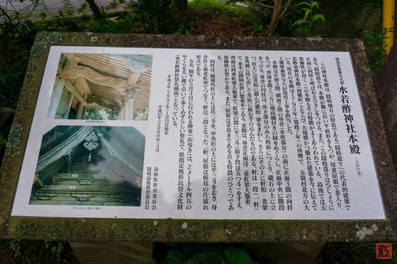](https://momijiaoi.net/wp-content/uploads/2021/06/mizuwakasu2015083029.jpg)

国指定重要文化財　水若酢神社本殿　（五箇村郡）

この神社本殿は、隠岐地方の特色である「隠岐造り」の代表的建築である。隠岐造りは、本殿が横に長い平面形をもつが、切妻屋根で妻入り、正面に向拝と呼ばれるひさしをつける。また、この隠岐造りはひじょうに装飾性が高く、この本殿もその特徴がよくあらわれている。島後では玉若酢命神社本殿（西郷町）とならび、大規模かつ優れた建築を今に伝えている。現在の本殿は1795年（寛政7年）の再興で、五箇村北方の大工棟梁森寄与八が造営工事を担当した。

本殿は正面3間、側面2間の身舎（本体部分）の前に正面3間の向拝をつけ、背面を除く三方に刎高欄付きの縁をめぐらし、正面中央に階段をつける。身舎の円柱は、床下部分のみ八角形につくり、礎石の上に立つ。柱上には井桁に組んだ敷桁・梁をまわし、さらにその上に軒桁・妻梁を外側に持ち出して井桁に組む手の込んだものである。軒は一段（一軒）で、垂木の間隔が狭い繁垂木である。妻飾は、身舎正面は二重虹梁大瓶束、背面は四重虹梁大瓶束で、虹梁の間に平三斗（最下段は五つ斗）をすえ、装飾性が豊かである。また、屋根は茅葺きである点も特徴のひとつである。

向拝は、両端角柱の上には出三斗を、中央柱の上には平三斗をおき、身舎柱と海老虹梁でつなぐ。軒は二段となった二軒、屋根は栃葺の片流れ形式である。

なお、隔年の5月3日に行われる神事「山曳き」は、2メートル四方のやぐらを太い縄で引いて歩くめずらしい祭礼で、県指定無形民俗文化財（水若酢神社祭礼風流）となっている。

平成4年（1992年）1月21日指定

[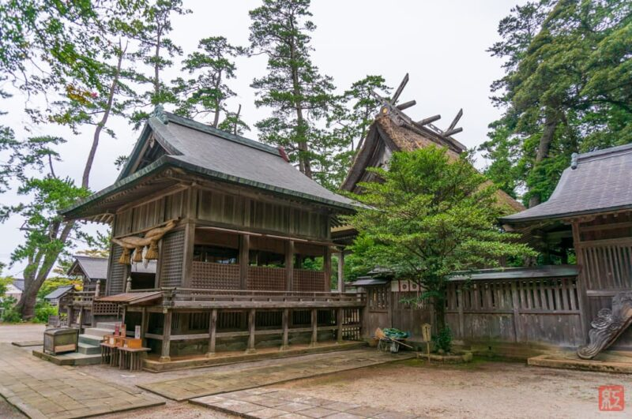](https://momijiaoi.net/wp-content/uploads/2021/06/mizuwakasu2015083011.jpg)

社殿全景

左手から撮った方が木がなくて本殿がよく見えたと後悔…

## 境内社等

[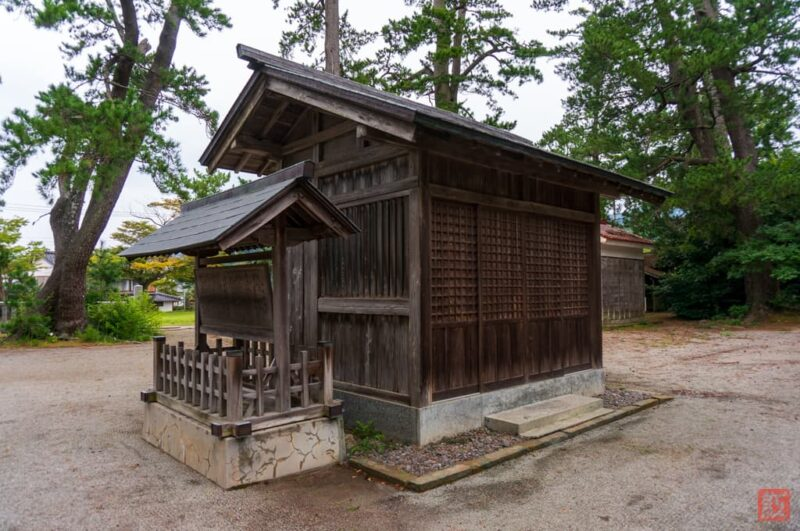](https://momijiaoi.net/wp-content/uploads/2021/06/mizuwakasu201508309.jpg)

神饌所？

[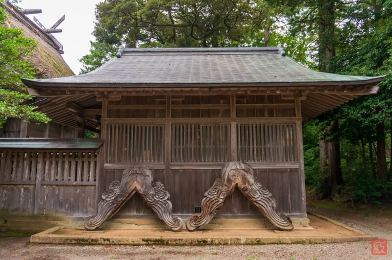](https://momijiaoi.net/wp-content/uploads/2021/06/mizuwakasu2015083014.jpg) [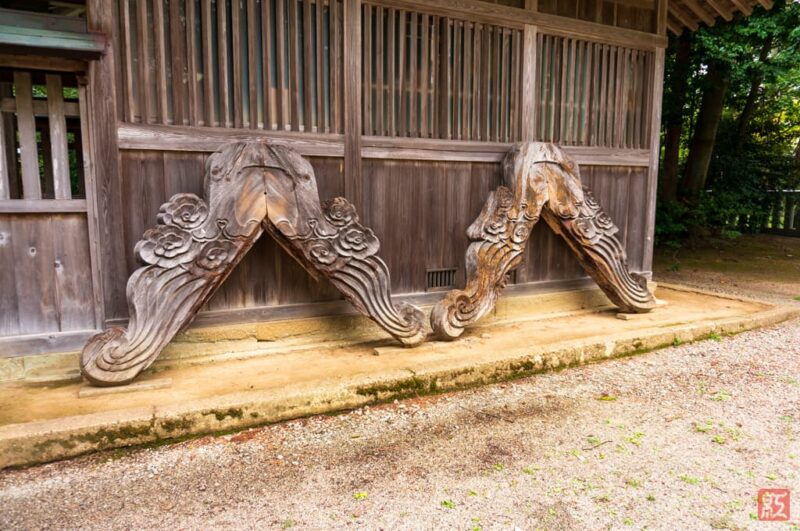](https://momijiaoi.net/wp-content/uploads/2021/06/mizuwakasu201508305.jpg)

鬼瓦

[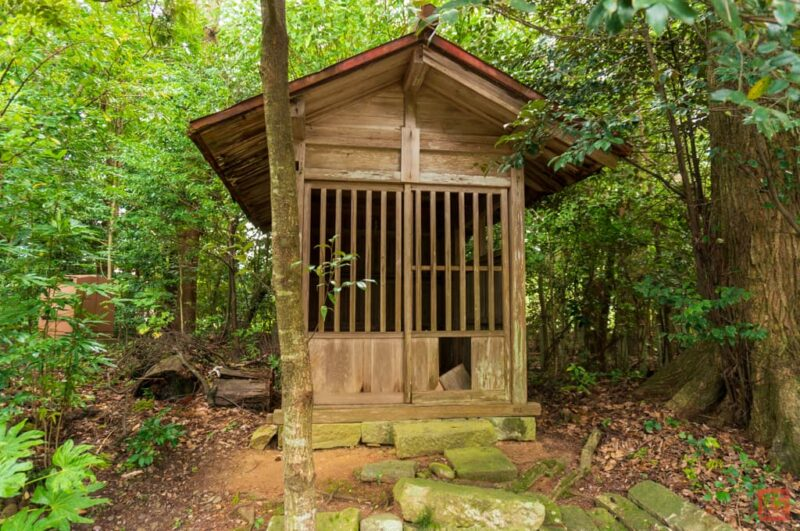](https://momijiaoi.net/wp-content/uploads/2021/06/mizuwakasu2015083013.jpg)

境内社？

[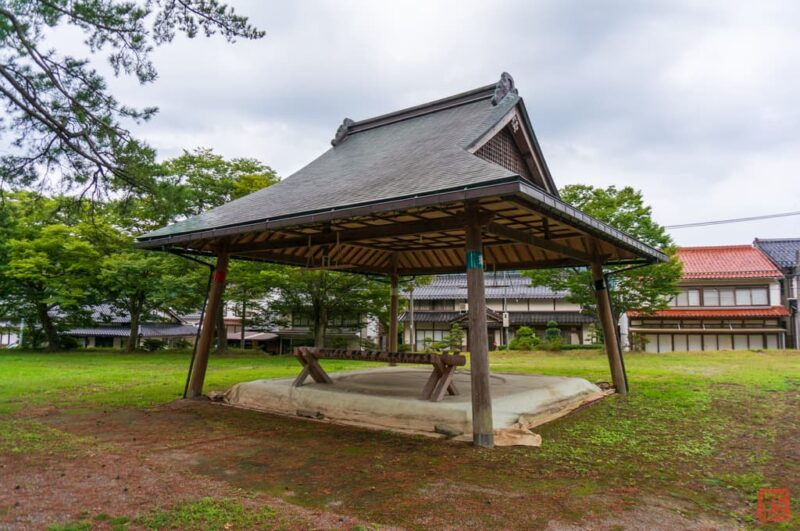](https://momijiaoi.net/wp-content/uploads/2021/06/mizuwakasu2015083027.jpg)

土俵

なお境外ですが、由緒の項に記載の捧羽山という場所に捧羽山社があります。捧羽山はその名に反して山ではなく田の中の小丘です。

現地を確認していないため確証はありませんが、『水若酢神社』（学生社）の写真を見る限り下図の場所だと思われます。

ここは伊後の浜宮であり、大峯山の遥拝所でもあるようです（[位置](https://goo.gl/maps/aViqB7vBDgvwFo9x6)）

また、やはり由緒項に記載の花勺の鯛石ですが、『水若酢神社』（学生社）によれば大峯山の山頂から北西、突出している峯の部分の先端にある台地上の一画だそうです。

まず門柱のように2つの鳥居石が並び、その奥に鯛石。

そのさらに奥に巨岩があり、同書では鯛石を供物台、奥の巨岩を本来の磐座ではないかとしています。

## 水若酢神社古墳群

神社そばに水若酢神社古墳群があります。現存しているのは2基。

[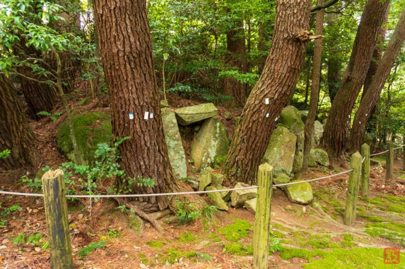](https://momijiaoi.net/wp-content/uploads/2021/06/mizuwakasu2015083025.jpg) [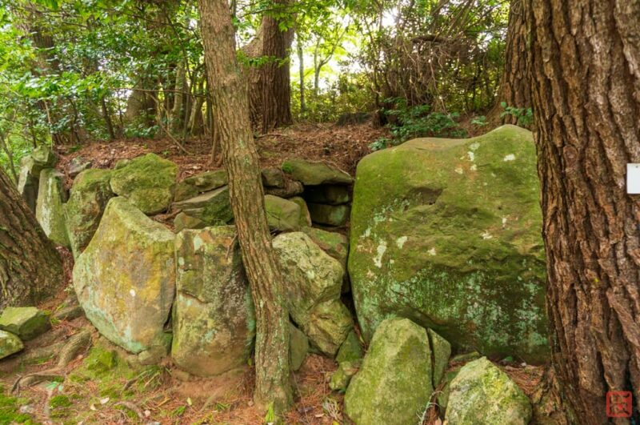](https://momijiaoi.net/wp-content/uploads/2021/06/mizuwakasu2015083024.jpg)

こちらは確か1号墳だったと思います

もう片方は未撮影。

[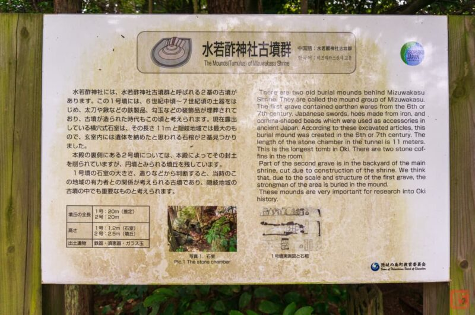](https://momijiaoi.net/wp-content/uploads/2021/06/mizuwakasu2015083015.jpg)

水若酢神社古墳群

水若酢神社には、水若酢神社古墳群と呼ばれる2基の古墳があります。この1号墳には、6世紀中頃～7世紀頃の土器をはじめ、太刀や鍬などの鉄製品、勾玉などの装飾品が埋葬されており、古墳が造られた時代もこの頃と考えられます。現在露出している横穴式石室は、その長さ11mと隠岐地域では最大のもので、玄室内には遺体を納めたと思われる石棺が2基見つかりました。

本殿の裏側にある2号墳については、本殿によってその封土を削られていますが、円墳とみられる墳丘を残しています。

1号墳の石室の大きさ、造りなどから判断すると、当時のこの地域の有力者との関係が考えられる古墳であり、隠岐地域の古墳の中でも重要なものと考えられます。

## 隠岐郷土館/五箇創生館

[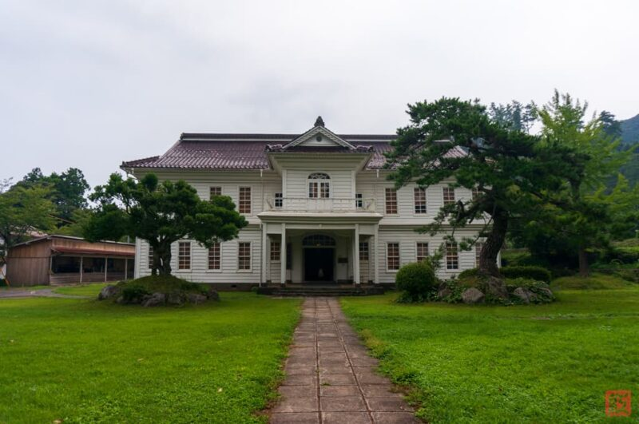](https://momijiaoi.net/wp-content/uploads/2021/06/mizuwakasu2015083016.jpg) [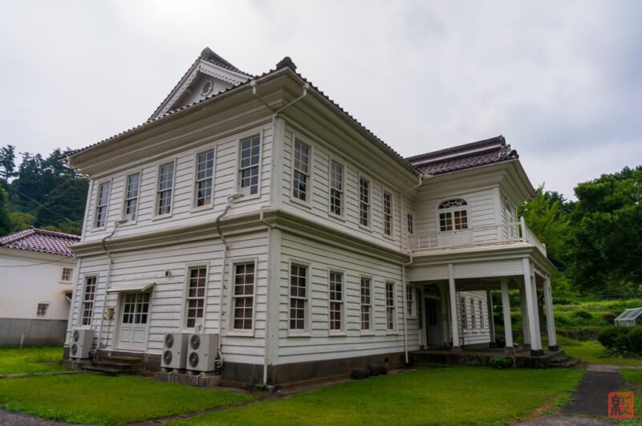](https://momijiaoi.net/wp-content/uploads/2021/06/mizuwakasu2015083019.jpg)

神社の東にある隠岐郷土館

建物は明治時代の隠岐郡役場を移築・修復したもので、県指定有形文化財です。民俗文化財や竹島の資料等の展示有。

[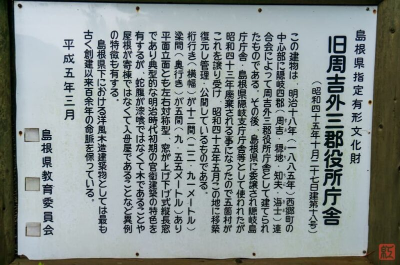](https://momijiaoi.net/wp-content/uploads/2021/06/mizuwakasu2015083023.jpg)

島根県指定有形文化財　旧周吉外三郡役所庁舎

（昭和四十五年十月二十七日建第十八号）

この建物は、明治十八年（一八八五年）西郷町の中心部に隠岐四郡（周吉・穏地・知夫・海士）連合会によって周吉外三郡役所庁舎として建てられたものである。その後、島根県に移譲され隠岐島庁庁舎・島根県隠岐支庁庁舎等として使われたが昭和四十三年廃棄される事になったので五箇村がこれを譲り受け、昭和四十五年五月この地に移築復元し管理・公開しているものである。

桁行き（横幅）が十二間（二二.九一メートル）梁間（奥行き）が五間（九.五五メートル）あり平面立面とも左右対象型、窓が上げ下げ式縦長窓であり典型的な明治時代初期の官衛建築の特色を有するが、蛇腹が漆喰ではなくて木であることや屋根が寄棟ではなくて入母屋であることなど異例の特徴も有する。

島根県下における洋風木造建築物としては最も古く創建以来百余年の命脈を保っている。

[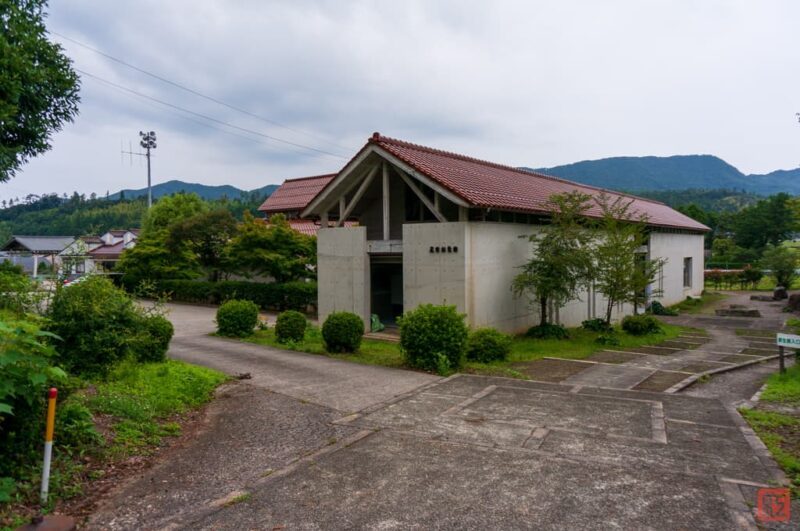](https://momijiaoi.net/wp-content/uploads/2021/06/mizuwakasu2015083026.jpg)

五箇創生館

こちらは牛突き大会や隠岐古典相撲等の資料展示があります。喫茶店もあり。

[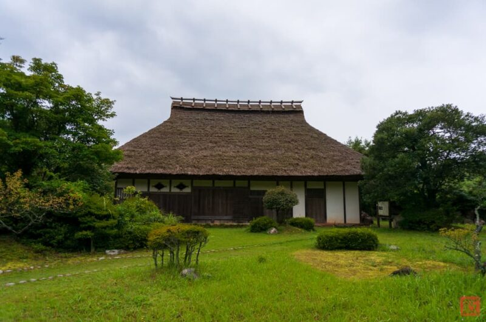](https://momijiaoi.net/wp-content/uploads/2021/06/mizuwakasu2015083021.jpg)

都万目の民家

[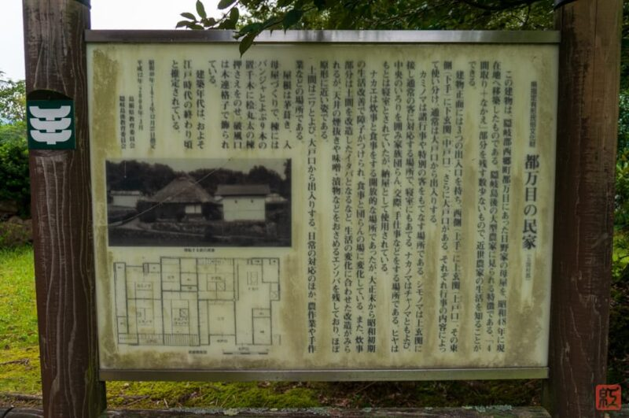](https://momijiaoi.net/wp-content/uploads/2021/06/mizuwakasu2015083020.jpg)

県指定有形民俗文化財　都万目の民家（五箇村郡）

この建物は、隠岐郡西郷町都万目にあった日野家の母屋を、昭和48年に現在地へ移築したものである。隠岐島後の大型農家に見られる特徴である、「4間取り+なかえ」部分を残す数少ないもので、近世農家の生活を知ることができる。

建物正面に3つの出入口を持ち、西側（上手）に上玄関（上戸口）、その東側（下手）に下玄関（中戸口）、さらに大戸口がある。それぞれ行事の内容によって使い分け、通常は大戸口から出入りする。

カミノマは諸行事や特別の客をもてなす場所である。シモノマは上玄関に接し通常の客に対応する場所で、寝室にもあてる。ナカノマはチャノマともよび、中央のいろりを囲み家族団らん、交際、手仕事などをする場所である。ヒヤはもとは寝室とされていたが、納屋として使用されている。

ナカエは炊事と食事をする開放的な場所であったが、大正末から昭和初期の生活改善で障子がつけられ、食事と団らんの場に変化している。また、炊事部分は土間を改造したイタバとなるなど、生活に変化に合わせた改造がみられるが、天井の煙抜きや味噌・漬物などをおさめるエンソバを残しており、ほぼ原形に近い姿である。

土間はニワとよび、大戸口から出入りする。日常の対応のほか、農作業や手作業などの場所である。

屋根は茅葺き、入母屋づくりで、棟にはバンジャとよぶ9本の置千木に桧丸太の棟押さえをのせ、破風口は木連格子で飾られている。

建築年代は、およそ江戸時代の終わり頃と推定されている。

[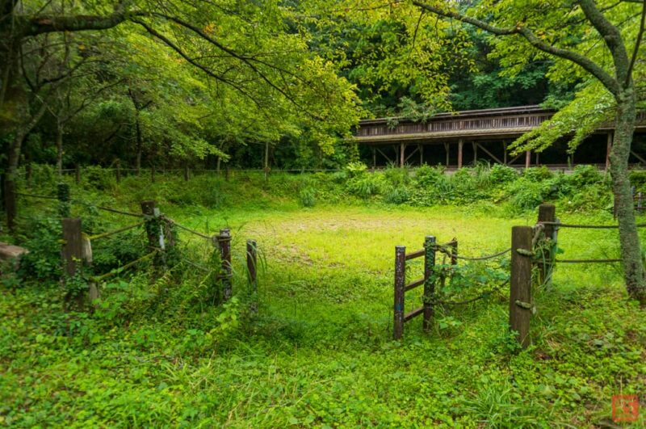](https://momijiaoi.net/wp-content/uploads/2021/06/mizuwakasu2015083022.jpg)

牛突場

## 由緒

[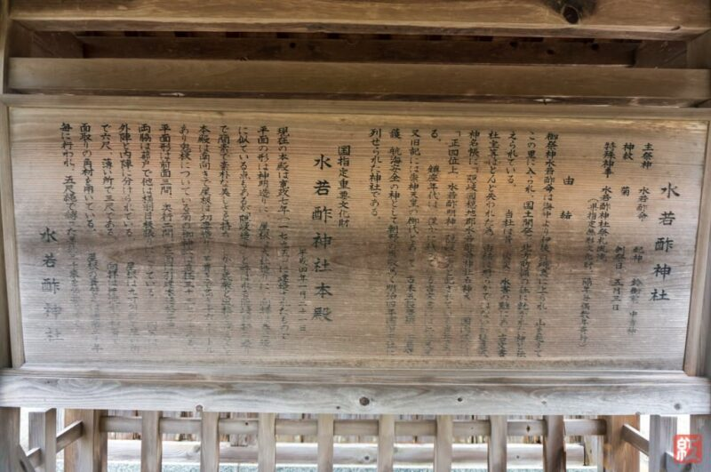](https://momijiaoi.net/wp-content/uploads/2021/06/mizuwakasu201508306.jpg)

由緒板

水若酢神社

主祭神　水若酢命　配神　鈴御前　中言神

神紋　菊　例祭日　五月三日

特殊神事　水若酢神社祭礼風流（県指定無形文化財、隔年毎偶数年斎行）

由緒

御祭神水若酢命は海中より伊後の磯島に上られ、山を越えてこの里に入られ、国土開発、北方防護の任に就かれた神と伝えられている。当社は昔、火災、水害の難にあい古文書社宝等ほとんど失われた為、由緒は明らかではないが延喜式神名帳に「隠岐國穏地郡水若酢命神社名神大」、国内帳には「正四位上、水若酢明神、隠岐一宮」と記されている古社である。鎮座年代は、僅かに残っている古文書には仁徳天皇、又旧記には崇神天皇の御代とあって、古来五穀豊穣、海島守護、航海安全の神として朝野の崇敬篤く明治4年国幣中社に列せられた神社である。

国指定重要文化財

水若酢神社本殿

現在の本殿は寛政七年（一七九五）に建造されたもので平面の形は神明造りに、屋根は大社造りに、向拝は春日造りに似ている点もあるが「隠岐造り」と呼ばれる隠岐独特の造りで簡素で素朴な美しさを持ち、しかも威厳と風格を備えている。

本殿は南向きで屋根は切妻造りの茅葺きで高さ十六メートルあり鬼板についている菊の御神紋は直径三十三センチある。

平面形は前面三間、奥行二間、正面は引違木連格子戸で、両脇は蔀戸で他は横羽目板張りになっている。内部は外陣と内陣に分けられている。屋根は九寸勾配で厚い所で六尺、薄い所で三尺である。向拝は片流れの栃葺で面取りの角材を用いている。屋根の葺替えは通常二十年毎に行われ、五尺縄で縛った茅約三千束を必要とする。

創建時期は不詳。

『隠州記』に、崇神天皇の御宇、当社祭神は海中から伊後（島後の北端）に上り、その後白鳩2羽に乗り現地に降臨、宮を造り一宮大明神と号した、とする縁起があったが兵火により燃えてしまったとあるとのこと。

また、当社を外宮、久見之社（伊勢命神社）を内宮とし、伊勢神宮からの勧請であるとも（『式内社調査報告』及び『日本の神々　神社と聖地』より。左記2書のいう『隠州記』が『新修島根県史　史料篇2』に所収の『増補隠州記』とは別本かは不明。『増補隠州記』に上記の記述が存在し、『日本の神々～』に「貞享5年の」とあるため、貞享5年成立である『増補隠州記』を指すと見て良いかと思われるが）。

また寛政7年（1795）の『一宮大明神濫觴之事』と題する文書には仁徳天皇の御宇勧請とあるとのこと。

なお隠岐の伝承によると、内容は以下の通り詳しいものになっています。

「伊後の代官屋（一橋家）の先祖が前の浜（あるいは西の浜）で魚を釣っていると白鷺がかかり、引き揚げると離れて捧羽山（芳葉山）の松の梢に止まった。次に代官屋の葛屋根の棟に、さらに花勺（鼻尺）の方へ飛び鯛の形をした石（鯛石）に止まった。その後郡へ行き端家（岩佐家）の傍らにある巨石に止まった。さらに鳥は飛び、一宮村の宮原の地に落ち着いた。代官屋と端家で相談し鳥を神として社を建てた。」

ちなみに一宮の宮原に至るまでにも神跡は残っており、以下の通りです。

1. 山田神社（水若酢神社の北東1km強、国道の右手。持ち運んでも元の所に戻るという力石伝説が残り、鎮座地小字は「鳥越」）
2. 鈴井の大岩（山田川・郡川水系を越える峠道の東方にある「鳥越」の峠道を越えた場所。郡川を生み出す河川の合流部。『水若酢神社』（学生社）の写真にはガードレールが写っているため車で行ける場所の模様。岩佐の巨石を里宮としこちらが奥宮に当たる。詳細不明。郡川ダムより上流？）
3. 岩佐の巨石（鈴井の大岩から右岸を下っていったところ。旧郡村の北西端。かつては熊野神社の神体石で、鈴井の大岩に対する里宮。現在は草木に埋もれている模様）

2、3は水の女神である鈴井の姫神を祀っていたようです。

この後、一宮村に鎮座の前に山田村に鎮座したらしく、ここが水若酢神社の第一鎮座地のようです。現社地より川を挟んで北側。

『隠州視聴合紀』によれば山田村の田園地帯から西へ10町程の林の中とあり、『穏座抜記』によれば山田邑の殿舎山に美豆別主神をまつる社殿があったとのこと。殿舎山は現在、古戸山の小字が残る峠山のことのようで、この古祭場を「須賀杜」といったそうです。第一鎮座地＝須賀杜なのかはわかりません。

その後一宮村の宮原に遷座します（時期不明）。

これは現社地より北西、山田川と郡川の合流地点付近になります。

延宝4年（1676）、五箇村は洪水に見舞われ、社殿が流失。重栖川の流路が変わったため旧地には戻れなくなり、移転となります。

神の姿が現れたため、郡村の高台・姿峠に仮遷座となりますが、これは実のところ、この頃郡村が五箇村の中心となっていたことに拠るようです（なので元の一宮村に遷らなかった）。

姿峠に仮宮を設けると、白鷺が西の方の松の木に止まり鳴き続けたため、その松の木の場所、つまり現社地に正式に遷座となりました。延宝6年（1678）のこと。この松は明神の松、または根上がりの松と呼ばれ、二の鳥居横にありましたが昭和46年8月15日に倒壊しました。

ここまでの神の足跡を見ると、以下のようになります。

伊後の浜辺→伊後の捧羽山（[伊後の棒羽山神社](https://goo.gl/maps/3eUT7QqmXGwbCAp38)か？）→代官屋の葛屋根→大峯山の花勺→[山田神社](https://goo.gl/maps/EqCDz4pWHTfEoe7W9)→鈴井の大岩→岩佐の巨石→山田村の一宮（第一次鎮座地・須賀杜？）→一宮村の宮原（第二次鎮座地）→郡村の姿峠（仮宮）→郡村の犬町（現社地）

兵火に罹り縁起は炎上してしまったため、実際のところは不明です。

続日本後紀　承和9年（842）9月14日条に「隠岐国智夫郡由良比売命神、海部郡宇受加命神、穏地郡水若酢命神並預官社」とあるのが国史での初見。

延喜式神名帳においては「隠岐国穏地郡　水若酢命神社　名神大」として名神大社に列せられています。

この後当社はしばらく史料に現れなくなります。

正長2年（1429）の『久清書状写』で「隠州大宮司社領」とあるのが中世史料での初見。

当時隠岐国で神官が大宮司を称したのは他にないため、この時点で当社が一宮であったとする見方もあります。

享禄3年（1530）の史料に「一宮造作」とあるのが明確に一宮を示す初見です。

ただし、『中世諸国一宮制の基礎的研究』では、当社は隠岐国神名帳などで正三位とされていた一方で、天健金草神社や玉若酢命神社は正一位とされており、また玉若酢命神社の神主が国造と呼ばれていたことから、中世期には玉若酢命神社が一宮の機能も兼ねており、当社は名目的一宮であったとのではないかとの考えが示されています。

享禄3年（1530）7月20日の隠岐久清判物に「就今度隠州不慮錯乱、大宮司謀叛仁同前候」と見え、同28日の代神六宛久重書状にて隠岐氏と対立した大宮司に代わり代神六が大宮司職に補任されています。

これらは検討を要する史料のようですが、代氏が大宮司を務めているのが天正5年（1577）の文書にも見え、『雲陽軍実記』『陰徳太平記』にも隠岐の天文合戦で島前島後とも隠岐氏が平定したとあることから、事件は事実だと見られています。

なお代氏以前の大宮司については不明。

『増補隠州記』一宮村の項に一宮明神、社領10石と見えますが、前述の通り延宝4年（1676）に洪水で流失、同6年（1678）に現社地に遷座。

寛政7年（1795）に後に国指定重要文化財となる隠岐造の本殿が造営されます。

江戸時代後期には当時の大宮司、忌部正興が天明飢饉について『凶年蔵土穂』という書を著して松江藩政を批判。幕末には国学者中西穀男が私塾膺懲館を設立して尊王攘夷を唱え、正義党が結成され大宮司忌部正弘は総指揮として隠岐騒動を指導。

明治4年国幣中社に列格。

その後時期不明ですが社名から命の一字をとり、水若酢神社に改称（『特選神名牒』では「水若酢命神社」表記のため、明治以降と思われます）。

戦後は神社本庁の別表神社に指定されています。

主祭神は水若酢命。

この神は記紀に名前の見えない地方神であり、詳しいことはわかっていません。

語義も、水が文字通り「水」の意か、美称としての「瑞」か、また、若酢も「湧す」か「若・ス」かは不明。同じ隠岐の式内社である玉若酢命神社との関連を見る向きもあります。

配祀の中言命、鈴御前についてもまたよくわかっていません。

『水若酢神社』（学生社）では、水若酢命を殿舎山の須賀杜の司祭者、豪族の名称で、「ワケ（別、和気）の称号を付与され、代々「ワケの主」として水の恩恵に感謝する祭儀を執り行ってきた」人々であるとし、「水は瑞のことでみずみずしい＝美称、尊敬する接頭語」だとします。

なお、司祭者達が祀っていたのは、水源の神、大峯山の神であるとします。

また同書では、『伊未自由来記』なる古書の記述として、水若酢命・中言命・鈴御前について記しています（『伊未自由来記』自体は永享3年（1431）に都万村持福寺の僧一閑なる人物が著したとされる書で、次々に島にやってきた新しい神が隠岐を支配する物語。穏地郡の古名「役道郡（いみじぐん）」が書名の由来。現在残るのは、明治43年、土地の老人が原本を読み上げた内容を書写したもの。『五箇村誌』に収録。なお、原本は未発見。当時の所有者の名前まで明記されているのですが。偽書と見る向きが強いようです）。

中言命は奈賀命と記され、阿遅鋤高彦根命の御子、鈴御前は須津姫と記され、丹波の須津首の媛。

奈賀命は須津姫を娶り来島し当地を治めたとされています。

『水若酢神社』（学生社）では、須津姫は実際には大神山の山神を斎きまつる鈴川（郡川）の当地の女神であり、託宣を伝える司祭者である奈賀命に統治権を託したと見ています。

その後、十挨命（初代意岐国造）が支配者となり、その妻神は伊未自姫（美豆別主命の娘）であるとします。

## 御朱印

**御朱印はあります。**

社務所で拝受可。

**オリジナル御朱印帳もあります。**

[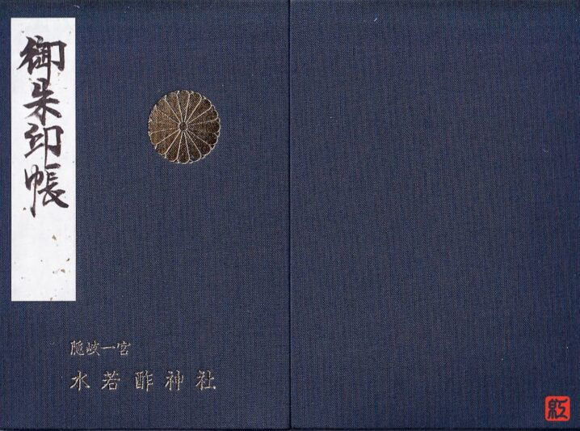](https://momijiaoi.net/wp-content/uploads/2021/07/mizuwakasu-goshuincho.jpg)

こちらも社務所で拝受可。

## アクセス

西郷港から国道485号をひたすら北西に進みます。13.5kmほど行ったところ（[位置](https://goo.gl/maps/jsBdhPxDoypXq43H7)）で右手の道に入ります（水若酢神社→の案内あり）。

するとすぐに鳥居があります。鳥居手前に駐車場あり。

## 神社概要

|  |  |
| --- | --- |
| 社名 | 水若酢神社（みずわかすじんじゃ） |
| 通称 | – |
| 旧称 | 水若酢命神社  一宮明神 |
| 住所 | 島根県隠岐郡隠岐の島町郡723 |
| 祭神 | 水若酢命 |
| 左相殿 | 中言神 |
| 右相殿 | 鈴御前 |
| 社格等 | 式内社　隠岐国穏地郡　水若酢命神社　名神大  続日本後紀　承和九年九月乙巳（十四）　水若酢命神　官社  旧国幣中社  隠岐国一宮  別表神社 |
| 札所等 | – |
| 御朱印 | あり |
| 御朱印帳 | あり |
| 駐車場 | あり |
| 公式Webサイト | – |
| 備考 | 鎮座地は伊後の浜辺→伊後の捧羽山→代官屋の葛屋根→大峯山の花勺→山田神社→鈴井の大岩→岩佐の巨石→山田村の一宮（第一次鎮座地・須賀杜？）→一宮村の宮原（第二次鎮座地）→郡村の姿峠（仮宮）→郡村の犬町（現社地）と変遷か |

## 参考文献

* 「水若酢神社」, 『日本歴史地名大系』（データベース「JapanKnowledge」）
* 「水若酢神社」, 神社本庁教学研究所研究室編『平成「祭」データ（CD-ROM）』全国神社祭祀祭礼総合調査本庁委員会, 1995
* 安部勝編『五箇村誌』島根県隠岐郡五箇村役場, 1989
* 式内社研究会編『式内社調査報告　第二十一巻　山陰道4』皇學館大学出版部, 1983
* 谷川健一編『日本の神々　神社と聖地　第七巻　山陰』白水社, 1985
* 水若酢神社編『水若酢神社』学生社, 2005