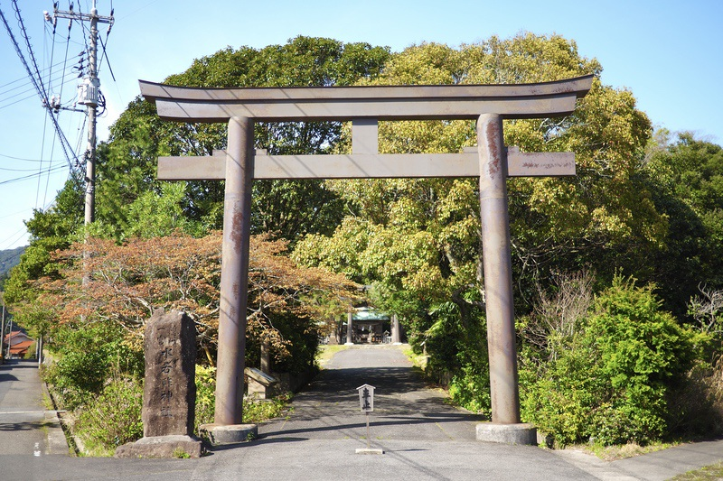

島根県隠岐郡隠岐の島町郡（こおり）に鎮座する「水若酢神社」（みずわかすじんじゃ）を訪ねました。

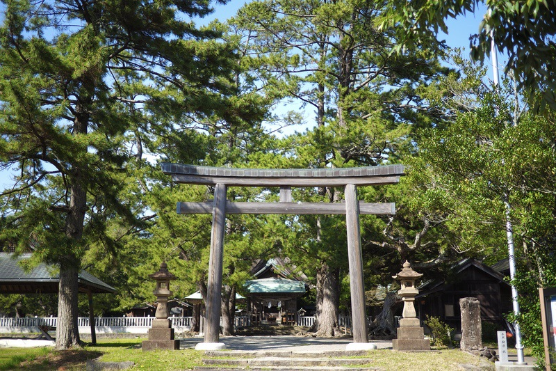

『延喜式』に式内社（名神大社）として記され、隠岐一宮とされる神社ですが、同じ一宮としては西ノ島の「[由良比女神社](https://omouhana.com/2024/06/08/%E7%94%B1%E8%89%AF%E6%AF%94%E5%A5%B3%E7%A5%9E%E7%A4%BE%EF%BC%9A%E5%B8%B8%E4%B8%96%E3%83%8B%E9%99%8D%E3%83%AB%E8%8A%B1%E3%80%80%E7%94%B1%E8%89%AF%E6%9C%97%E6%9C%88%E7%AF%87%E3%80%8006/)」があります。

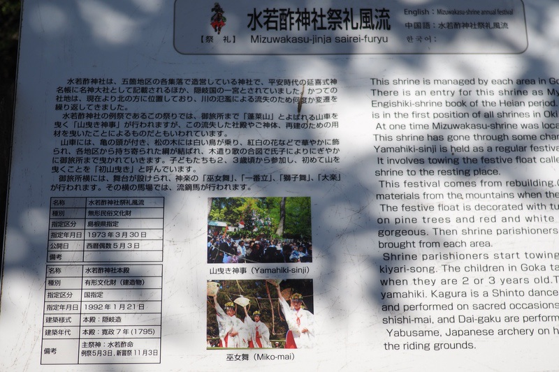

例祭「風流」（ふりゅう）は令和奇数年の5月3日に行われ、[玉若酢命神社](https://omouhana.com/2025/05/07/%E7%8E%89%E8%8B%A5%E9%85%A2%E5%91%BD%E7%A5%9E%E7%A4%BE%EF%BC%9A%E5%B8%B8%E4%B8%96%E3%83%8B%E9%99%8D%E3%83%AB%E8%8A%B1%E3%80%80%E6%8A%93%E6%B4%A5%E5%A4%8F%E6%9C%88%E7%AF%87%E3%80%8001/)の「御霊会風流」と[一之森神社／八王子神社](https://omouhana.com/2025/05/10/%E4%B8%80%E4%B9%8B%E6%A3%AE%E7%A5%9E%E7%A4%BE%EF%BC%8F%E5%85%AB%E7%8E%8B%E5%AD%90%E7%A5%9E%E7%A4%BE/)の「武良祭風流」とともに隠岐三大祭りの一つとされ、昭和48年（1973年）に県の無形民俗文化財に指定されました。  
祭りは7歳くらいまでの男児たちによる山曳（やまびき）に始まり、獅子舞、浦安の舞、流鏑馬（やぶさめ）などが行われます。

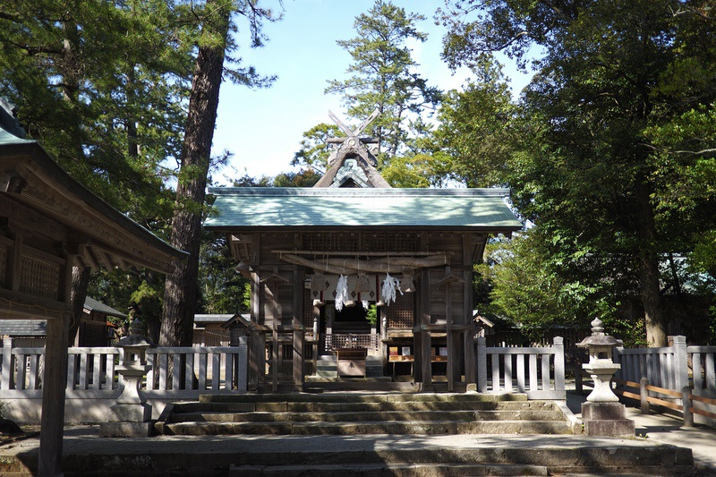

祭神は「水若酢命」（みずわかすのみこと）で、配祀神は「中言命」（なかごとのみこと／中言神）と「鈴御前」（すずのごぜん）。

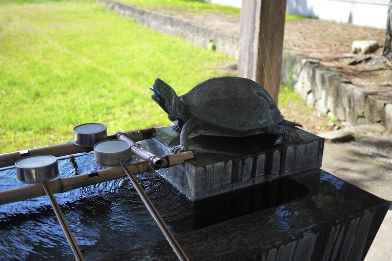

これまた聞いたことのない神々なので、御朱印をいただく際に社務所の方に伺ってみました。  
しかし社でもよく分からない、とそのようなお返事をいただきました。

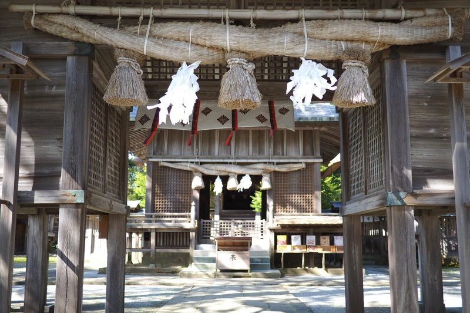

中言神は「中言神社」というのが隠岐にもあり、そこでは「天津児屋根命」、つまりアメノコヤネが祀られています。  
和歌山の[中言神社](https://omouhana.com/2023/09/25/%E4%B8%AD%E8%A8%80%E7%A5%9E%E7%A4%BE%E3%80%80%E6%9C%AC%E7%A4%BE%EF%BC%9A%E5%85%AB%E9%9B%B2%E3%83%8B%E6%95%A3%E3%83%AB%E8%8A%B1%E3%80%80%E5%9C%9F%E9%9B%B2%E6%AD%8C%E8%AD%9A%E7%AF%87%E3%80%80%E7%95%AA/)には名草戸畔（なぐさとべ）が祀られていましたが、「中言」とは「神の言葉を人に伝える」という審神者（さにわ）の職の者を指すと思われます。  
ここ水若酢神社での中言神は、アメノコヤネのことでしょうか。

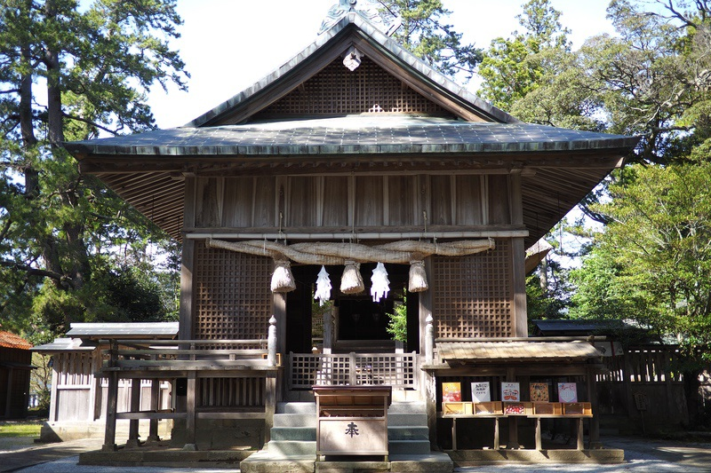

鈴御前は謎ですが、僕が思い当たるのは能登半島の先端、「[珠洲](https://omouhana.com/2024/09/13/%E9%A0%88%E9%A0%88%E7%A5%9E%E7%A4%BE-%E5%A5%A5%E5%AE%AE%EF%BC%9A%E5%B8%B8%E4%B8%96%E3%83%8B%E9%99%8D%E3%83%AB%E8%8A%B1%E3%80%80%E6%BD%9F%E5%A7%AB%E7%9C%89%E6%9C%88%E7%AF%87%E3%80%8004/)」地区のことです。  
珠洲の御前が誰なのかは不明ですが、あるいはミホススミのことかもしれません。  
いずれにせよ、平安時代延長5年（927年）成立の『延喜式』神名帳での祭神の記載は1座で、記載は「水若酢命神社」とあり、本来の祭神は「水若酢命」一柱であることが窺い知れます。  
しかしこの神こそ、謎であると言えます。

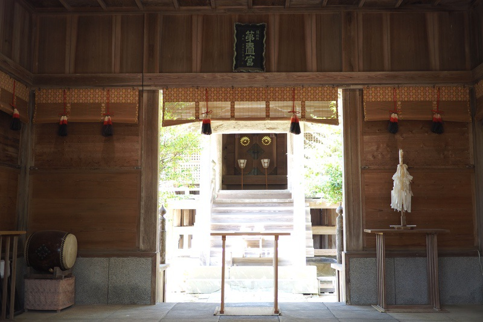

「ミズワカス」の「ミズ」は、文字通りの「水」の意とする説や、美称の「瑞」の意とする説などががあって明らかでなく、「ワカス」の字義も明らかではありません。  
確かな資料ではありませんが、古伝書の『伊未自由来記』には、「美豆別主命」（水若酢命）・「奈賀命」（中言命）・「須津姫」（鈴御前）の伝承が記されているとのことです。

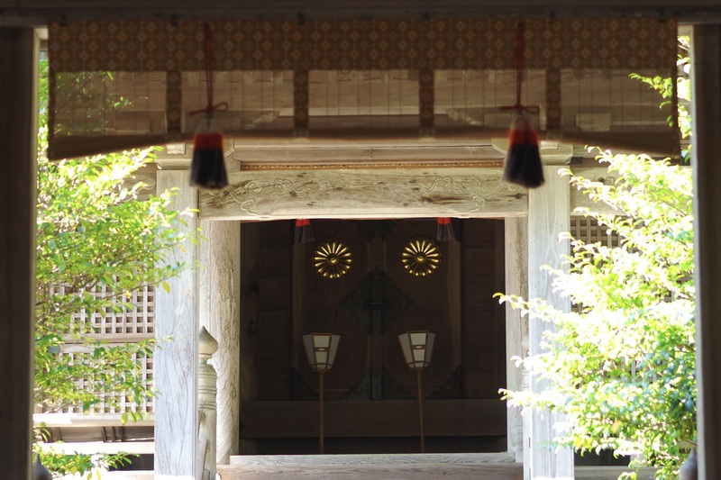

貞享5年（1688年）の『隠州記』では、10代崇神大君の時に神が海中から伊後の地に上がり、白鳩2羽に乗って遷座したと記されます。  
また隠岐島の伝承では、白鳩ではなく白鷺によって神が伊後から捧羽山（ほうばやま／芳葉山）を経て山田村、一宮村宮原と移り、さらに江戸時代の洪水の際に現社地の郡村犬町に遷座したとされています。  
そして水若酢神社に伝わる神紋は「十六葉一重菊」（じゅうろくようひとえおもてぎく）。  
八重ではないものの、当社祭神が皇室の由来と深い関わりがあることを思わせます。

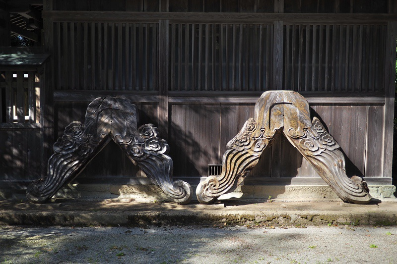

我が国における菊の歴史は古く、仁徳大君の古墳時代にまで遡ります。  
当時、大陸より伝来された菊には長寿の薬用効果があると伝えられていました。  
鎌倉時代に隠岐に配流された「後鳥羽上皇」が菊の紋をことのほか愛したと伝えられ、衣服などの様々な日常品に菊の紋を記し、自ら焼刃を入れた刀に16弁の菊紋を彫ったものが、天皇家の紋章として公に取り入れられるようになったといわれています。

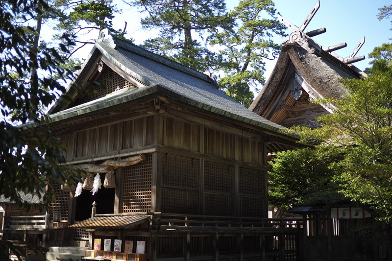

さて、祭神の水若酢ですが、一説に「ミズワカス」をそのまま「お湯を沸かす」と捉え、製鉄に関わる神ではないかと考える向きもあるようです。  
しかし玉若酢もあるわけで、その説でいうなら「タマワカス」となり、男性とって不穏な内容となってしまいます。  
玉若酢命神社の元宮「[和氣能酢神社](https://omouhana.com/2025/05/08/%E5%92%8C%E6%B0%A3%E8%83%BD%E9%85%A2%E7%A5%9E%E7%A4%BE%EF%BC%9A%E5%B8%B8%E4%B8%96%E3%83%8B%E9%99%8D%E3%83%AB%E8%8A%B1%E3%80%80%E6%8A%93%E6%B4%A5%E5%A4%8F%E6%9C%88%E7%AF%87%E3%80%8002/)」では酒造りが為されていたようなので、製鉄よりも酒造と捉えた方が自然な気もします。  
ともあれ「ワカス」という両者共通の名称が鍵となるのは間違いなさそうで、土地の開拓神としての両者の関係もそこにあるように思われます。

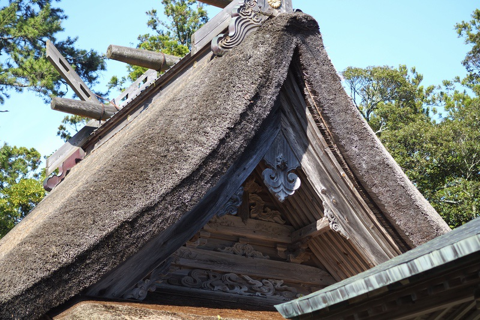

「酢」という独特の響きは、磯城・大和王朝最後の大君「彦道主」の、その娘「日葉酢媛」（ひばすひめ）と関係があるのではないかとの声も聞こえて来ました。  
ヒバス媛は265年に晋に使者を送り、晋書にヒミコと書かれた人物で、崇神王の息子・イクメ大君（垂仁）に嫁ぎました。  
彼女は父の古墳（東大寺山古墳）を造り直し、晩年には父の住んだ因幡国に住んだので、比婆山に葬られた神話が作られたといいます。  
因幡国と隠岐は関係が深く、因幡の素兎のウサギがいた島は隠岐島だったともされます。  
水若酢・玉若酢が、日葉酢媛の子孫だという可能性もあるかもしれません。  
「10代崇神大君の時に神が海中から伊後の地に上がった」という伝承とも、多少遡りますが、時代的に近いと考えられます。

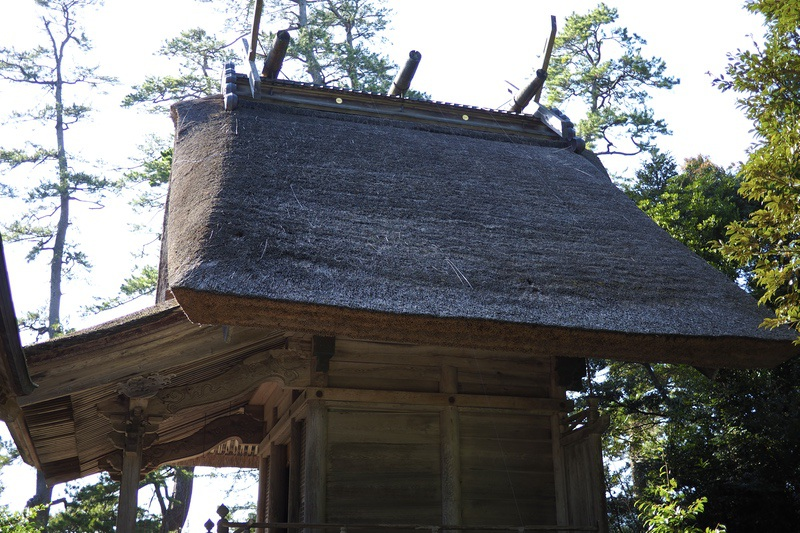

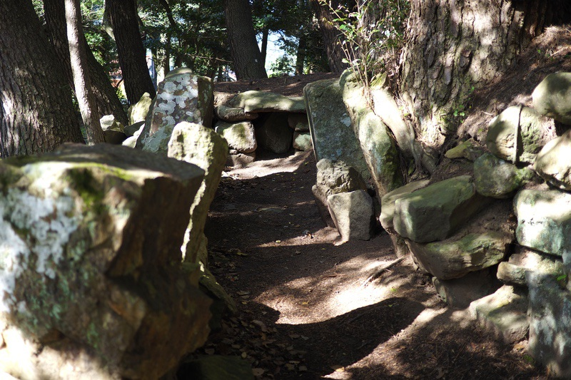

水若酢神社の境内一帯には「水若酢神社古墳群」と称される古墳時代後期の古墳群が分布しています。  
かつては数基の古墳があったとのことですが、現在は2基のみを遺存しています。  
そのうちの1号墳は石室全長が約11メートルと、隠岐諸島では最大級の規模になります。  
この石室内部では石棺2基のほか、鉄製品（太刀・鍬など）・勾玉などの副葬品が検出され、6世紀中頃-7世紀頃の土器も出土しています。

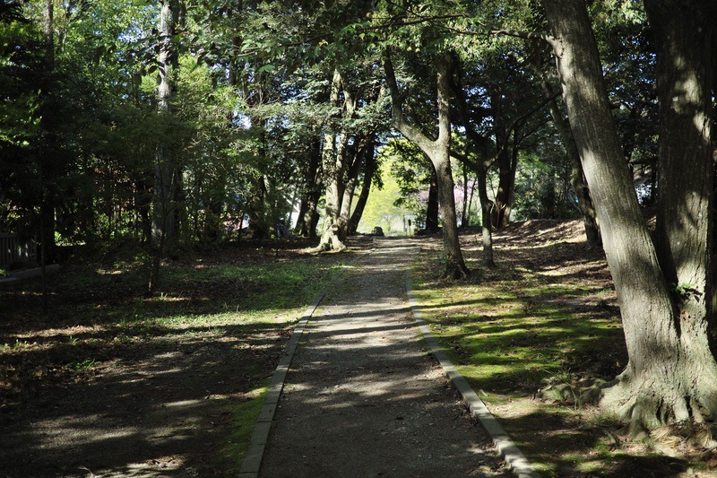  
、  
一宮（いちのみや）とは、平安時代に国司がその国の神社を参拝して回る時、最初に出掛ける神社を指したものとされますが、水若酢神社はその一宮でした。  
しかし『隠岐国神名帳』によれば、当社は「正三位 水若酢明神」として正三位の位置づけにあった一方、「天健金草神社」や「玉若酢命神社」は正一位の位置づけにあったことから、中世期には地位が低下し、名目上の一宮であった可能性も指摘されています。  
中世の隠岐諸島では、隠岐国守護代である隠岐氏の伸長に伴って隠岐氏・在地勢力の間で対立が強まっており、隠岐氏との争いの中で水若酢神社の大宮司が没落したのは事実とされているそうです。  
現在の大宮司は忌部氏のようです。

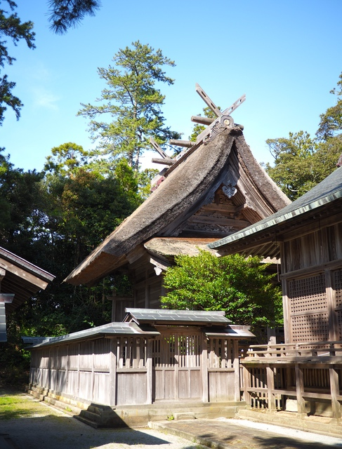

水若酢神社の本殿は隠岐造りで、寛政7年（1795）の造営となります。  
この「隠岐造り」と呼ばれる神社は、明確なもので、水若酢神社、玉若酢命神社、[伊勢命神社](https://omouhana.com/2025/05/19/%E4%BC%8A%E5%8B%A2%E5%91%BD%E7%A5%9E%E7%A4%BE%EF%BC%9A%E5%B8%B8%E4%B8%96%E3%83%8B%E9%99%8D%E3%83%AB%E8%8A%B1%E3%80%80%E6%8A%93%E6%B4%A5%E5%A4%8F%E6%9C%88%E7%AF%87%E3%80%8006/)、[高田神社](https://omouhana.com/2025/05/13/%E9%AB%98%E7%94%B0%E7%A5%9E%E7%A4%BE%EF%BC%9A%E5%B8%B8%E4%B8%96%E3%83%8B%E9%99%8D%E3%83%AB%E8%8A%B1%E3%80%80%E6%8A%93%E6%B4%A5%E5%A4%8F%E6%9C%88%E7%AF%87%E3%80%8003/)の島後に4社、あと島前の[宇受賀命神社](https://omouhana.com/2024/06/03/%E5%AE%87%E5%8F%97%E8%B3%80%E5%91%BD%E7%A5%9E%E7%A4%BE%EF%BC%9A%E5%B8%B8%E4%B8%96%E3%83%8B%E9%99%8D%E3%83%AB%E8%8A%B1%E3%80%80%E7%94%B1%E8%89%AF%E6%9C%97%E6%9C%88%E7%AF%87%E3%80%8004/)1社のみとのことです。  
その造りは、正面の形が[伊勢神宮](https://omouhana.com/2018/04/19/%E4%BC%8A%E5%8B%A2%E7%A5%9E%E5%AE%AE%E3%83%BB%E5%86%85%E5%AE%AE%EF%BC%9A%E6%96%8E%E7%8E%8B%E3%80%8012/)の「唯一神明造」（ゆいいつしんめいづくり）で、屋根は[出雲大社](https://omouhana.com/2017/08/06/%E5%87%BA%E9%9B%B2%E5%A4%A7%E7%A4%BE%EF%BC%88%E6%9D%B5%E7%AF%89%E5%A4%A7%E7%A4%BE%EF%BC%89%E5%89%8D%E7%B7%A8%EF%BC%9A%E5%85%AB%E9%9B%B2%E3%83%8B%E6%95%A3%E3%83%AB%E8%8A%B1%E3%80%8001/)の「大社造」、向拝は[春日大社](https://omouhana.com/2018/05/13/%E6%98%A5%E6%97%A5%E5%A4%A7%E7%A4%BE%E3%80%80%E5%89%8D%E7%B7%A8%EF%BC%9A%E8%A8%98%E7%B4%80%E3%83%8B%E5%81%B2%E3%83%95%E3%80%8001/)の「春日造」を合わせた、隠岐独特の神社建築様式とされますが、「隠岐起源説」によれば、隠岐造りこそががひな形であり、それが日本各地に伝播して行ったのだと主張されているようです。

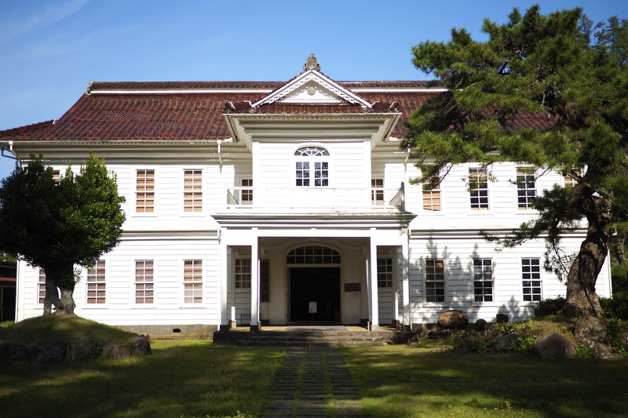

なるほど、とも思いますが、真実はいかに。  
祭神の出自についても、僕は少し違うものを見ていたのでした。

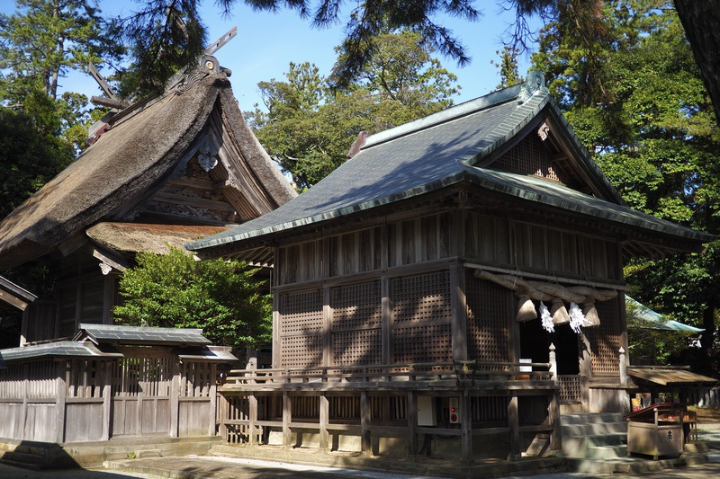

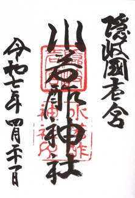

### *関連*